<a id="top"></a>

# 11c — Comprendre DAX dans Power BI : mesures, indicateurs, contexte de calcul et analyse métier

## Objectif général du tutoriel

Ce tutoriel présente le rôle de DAX dans Power BI à travers une approche progressive, détaillée et orientée vers l’usage professionnel des rapports analytiques.

L’objectif n’est pas simplement de présenter quelques formules à copier dans Power BI. L’objectif est de comprendre pourquoi DAX existe, ce qu’il apporte à un modèle de données, comment il transforme des colonnes brutes en indicateurs exploitables, et pourquoi il devient indispensable dès que l’on souhaite construire un rapport réellement analytique.

Dans Power BI, il est possible de produire rapidement un graphique à partir d’un fichier Excel, d’un fichier CSV ou d’une base de données. Toutefois, un rapport professionnel ne se limite pas à afficher une somme, une moyenne ou une liste de valeurs. Il doit permettre de répondre à des questions métier précises, de mesurer une performance, de comparer des résultats, d’identifier des écarts et d’aider à prendre une décision.

DAX intervient exactement à ce niveau. Il permet de créer des mesures, des colonnes calculées et des tables calculées. Il permet également de construire des indicateurs comme le chiffre d’affaires, la marge, le taux de marge, le panier moyen, le pourcentage du total, la croissance annuelle, l’écart entre le budget et le réel, ou encore le classement des meilleurs produits.

Dans ce tutoriel, DAX sera présenté comme la couche analytique de Power BI. Power Query prépare les données. Le modèle de données organise les relations entre les tables. DAX calcule les indicateurs. Les visualisations présentent les résultats.

---

## Table des matières

| # | Section |
|---|---|
| 1 | [Position de DAX dans l’architecture Power BI](#section-1) |
| 2 | [Ce que Power BI permet de faire sans DAX](#section-2) |
| 3 | [Pourquoi les données brutes ne suffisent pas](#section-3) |
| 4 | [Définition et rôle de DAX](#section-4) |
| 5 | [Différence entre Power Query, modèle de données, DAX et visualisations](#section-5) |
| 6 | [Les objets DAX : mesure, colonne calculée et table calculée](#section-6) |
| 7 | [Les trois types de mesures dans Power BI](#section-7) |
| 8 | [La notion centrale de contexte de calcul](#section-8) |
| 9 | [Contexte de filtre, contexte de ligne et transition de contexte](#section-9) |
| 10 | [Les fonctions DAX fondamentales](#section-10) |
| 11 | [Étude de cas 1 : construire des indicateurs de ventes](#section-11) |
| 12 | [Étude de cas 2 : marge, rentabilité et performance commerciale](#section-12) |
| 13 | [Étude de cas 3 : pourcentage du total et contribution régionale](#section-13) |
| 14 | [Étude de cas 4 : comparaison temporelle et évolution annuelle](#section-14) |
| 15 | [Organisation professionnelle des mesures DAX](#section-15) |
| 16 | [Erreurs fréquentes et corrections recommandées](#section-16) |
| 17 | [Synthèse finale](#section-17) |

---

<a id="section-1"></a>

<details>
<summary>1 — Position de DAX dans l’architecture Power BI</summary>

<br/>

DAX occupe une place centrale dans Power BI, mais il ne travaille pas seul. Pour bien comprendre son rôle, il faut replacer DAX dans l’ensemble du processus de création d’un rapport.

Un projet Power BI commence généralement par une source de données. Cette source peut être un fichier Excel, un fichier CSV, une base SQL, un dossier contenant plusieurs fichiers, une plateforme cloud, un service SharePoint, une API ou un entrepôt de données.

Ensuite, les données sont préparées dans Power Query. Cette étape sert à nettoyer les données, supprimer les colonnes inutiles, corriger les types, transformer les dates, remplacer certaines valeurs, filtrer les lignes et préparer les tables pour l’analyse.

Une fois les tables préparées, elles sont chargées dans le modèle de données Power BI. À ce niveau, les tables peuvent être reliées entre elles. Par exemple, une table `Ventes` peut être reliée à une table `Produits`, à une table `Clients`, à une table `Régions` et à une table `Date`.

DAX intervient ensuite pour créer la couche analytique. Il permet de calculer des mesures et des indicateurs à partir des données présentes dans le modèle. Ces indicateurs sont ensuite utilisés dans les visualisations.

Le flux général peut être représenté ainsi.

```mermaid
flowchart LR
    A["Sources de données<br/>Excel, CSV, SQL, API, SharePoint"] --> B["Power Query<br/>Nettoyage et transformation"]
    B --> C["Modèle de données<br/>Tables et relations"]
    C --> D["DAX<br/>Mesures et indicateurs"]
    D --> E["Visualisations Power BI<br/>Graphiques, tableaux, cartes, KPI"]
    E --> F["Analyse et prise de décision"]
````

Ce diagramme montre que DAX n’est pas la première étape du travail dans Power BI. DAX intervient après la préparation et l’organisation des données. Il s’appuie sur les tables propres et sur les relations du modèle pour produire des calculs fiables.

Il est donc important de comprendre que DAX ne remplace pas Power Query. Il ne remplace pas non plus le modèle de données. DAX complète ces éléments en ajoutant la capacité d’analyse.

Une bonne pratique consiste à séparer clairement les responsabilités. Les opérations de nettoyage doivent être faites dans Power Query. Les relations doivent être construites dans le modèle. Les indicateurs dynamiques doivent être écrits avec DAX.

Cette séparation rend le rapport plus clair, plus solide et plus facile à maintenir.

</details>

<p align="right"><a href="#top">↑ Retour en haut</a></p>

---

<a id="section-2"></a>

<details>
<summary>2 — Ce que Power BI permet de faire sans DAX</summary>

<br/>

Power BI peut déjà produire des résultats utiles sans que l’on écrive directement des formules DAX. C’est l’une des raisons pour lesquelles l’outil est apprécié : il permet de créer rapidement un premier rapport visuel à partir d’un ensemble de données.

Lorsqu’une colonne numérique est ajoutée dans un graphique, Power BI peut automatiquement appliquer une agrégation. Par exemple, il peut additionner les valeurs, calculer une moyenne, afficher un minimum, afficher un maximum ou compter le nombre de lignes.

Si une table contient une colonne `Montant`, Power BI peut afficher automatiquement une somme.

```text
Somme de Montant
```

Si une table contient une colonne `Prix`, Power BI peut afficher une moyenne.

```text
Moyenne de Prix
```

Si une table contient une colonne `Produit`, Power BI peut compter le nombre de produits affichés.

```text
Nombre de Produit
```

Ces fonctionnalités sont pratiques pour construire rapidement des rapports descriptifs. On peut créer un graphique des ventes par région, un tableau des ventes par produit, une carte affichant le total des ventes ou un segment permettant de filtrer une année.

Cependant, ces calculs automatiques sont limités, car ils restent génériques. Power BI peut additionner une colonne, mais il ne connaît pas automatiquement la logique métier de l’organisation.

Il ne peut pas deviner que la marge doit être calculée en retirant certains coûts du chiffre d’affaires. Il ne peut pas deviner que le panier moyen doit être calculé par client distinct et non par ligne de vente. Il ne peut pas deviner que le taux de croissance doit comparer la période actuelle avec une période précédente spécifique. Il ne peut pas deviner non plus quelle règle utiliser pour déterminer si un objectif est atteint.

Le rapport sans DAX peut donc afficher des valeurs, mais il ne porte pas encore toute la logique analytique nécessaire à l’interprétation.

Le schéma suivant illustre cette différence.

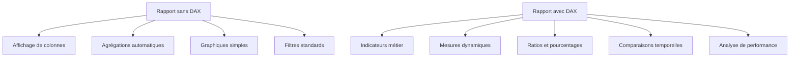

Un rapport sans DAX peut être suffisant pour une première exploration. En revanche, un rapport d’analyse métier exige généralement des mesures DAX bien définies.

</details>

<p align="right"><a href="#top">↑ Retour en haut</a></p>

---

<a id="section-3"></a>

<details>
<summary>3 — Pourquoi les données brutes ne suffisent pas</summary>

<br/>

Les données brutes représentent les informations enregistrées dans les systèmes. Elles peuvent provenir d’un système de ventes, d’un logiciel de facturation, d’un CRM, d’un ERP, d’un fichier Excel ou d’une base de données. Ces données sont essentielles, mais elles ne répondent pas toujours directement aux questions d’analyse.

Prenons une table de ventes simple.

| VenteID | Produit | Quantité | PrixUnitaire | CoutUnitaire |
| ------- | ------- | -------: | -----------: | -----------: |
| 1       | Souris  |        3 |           20 |           10 |
| 2       | Clavier |        2 |           50 |           30 |
| 3       | Écran   |        1 |          200 |          150 |

Cette table indique ce qui a été vendu, en quelle quantité, à quel prix et avec quel coût unitaire. Cependant, plusieurs indicateurs importants ne sont pas directement présents.

Le chiffre d’affaires n’est pas une colonne existante. Il doit être calculé. Le coût total n’est pas directement disponible. Il doit aussi être calculé. La marge est encore un autre calcul. Le taux de marge est un ratio. La contribution de chaque produit au total est un calcul supplémentaire.

On peut représenter cette transformation ainsi.

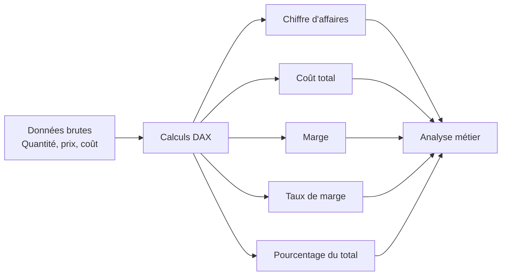

Le rôle de DAX est de transformer ces données de départ en indicateurs interprétables.

Par exemple, la ligne suivante contient trois informations brutes.

| Produit | Quantité | PrixUnitaire |
| ------- | -------: | -----------: |
| Souris  |        3 |           20 |

À partir de ces informations, il est possible de calculer le chiffre d’affaires de cette ligne.

```text
Chiffre d’affaires = 3 × 20 = 60
```

Mais dans un rapport Power BI, on ne veut pas seulement calculer une ligne. On veut généralement calculer le chiffre d’affaires total, le chiffre d’affaires par produit, par région, par client, par mois, par année ou par catégorie. C’est pour cela qu’une mesure DAX est préférable à un simple calcul statique.

Une mesure peut s’adapter à tous ces contextes.

```DAX
ChiffreAffaires =
SUMX(
    Ventes,
    Ventes[Quantité] * Ventes[PrixUnitaire]
)
```

Cette mesure pourra être utilisée dans une carte, dans un graphique par produit, dans un tableau par région ou dans une matrice par année et par catégorie. Le calcul reste le même, mais le résultat s’adapte automatiquement au contexte du rapport.

</details>

<p align="right"><a href="#top">↑ Retour en haut</a></p>

---

<a id="section-4"></a>

<details>
<summary>4 — Définition et rôle de DAX</summary>

<br/>

DAX signifie `Data Analysis Expressions`. Il s’agit du langage de calcul utilisé dans Power BI pour créer des indicateurs analytiques à partir du modèle de données.

DAX permet d’écrire des formules qui utilisent les tables, les colonnes, les relations et les filtres du modèle. Ces formules peuvent être simples, comme une somme, ou plus avancées, comme un calcul de croissance annuelle, un pourcentage du total, un classement ou un indicateur conditionnel.

Une formule DAX simple peut calculer le total des ventes.

```DAX
TotalVentes = SUM(Ventes[Montant])
```

Une formule DAX peut calculer une marge.

```DAX
Marge =
[ChiffreAffaires] - [CoutTotal]
```

Une formule DAX peut calculer un ratio.

```DAX
TauxMarge =
DIVIDE(
    [Marge],
    [ChiffreAffaires],
    0
)
```

Une formule DAX peut aussi modifier le contexte de calcul.

```DAX
VentesCanada =
CALCULATE(
    [TotalVentes],
    Clients[Pays] = "Canada"
)
```

Le point essentiel est que DAX ne sert pas seulement à faire des calculs mathématiques. Il sert à définir la logique analytique du rapport. Une mesure DAX exprime une règle de calcul. Cette règle peut ensuite être utilisée dans plusieurs visualisations.

Par exemple, une mesure `ChiffreAffaires` peut être utilisée dans une carte pour afficher le total global. Elle peut aussi être utilisée dans un graphique pour afficher les ventes par mois. Elle peut être utilisée dans un tableau pour comparer les régions. Elle peut également servir de base pour calculer une marge ou un pourcentage.

Le diagramme suivant montre cette logique de réutilisation.

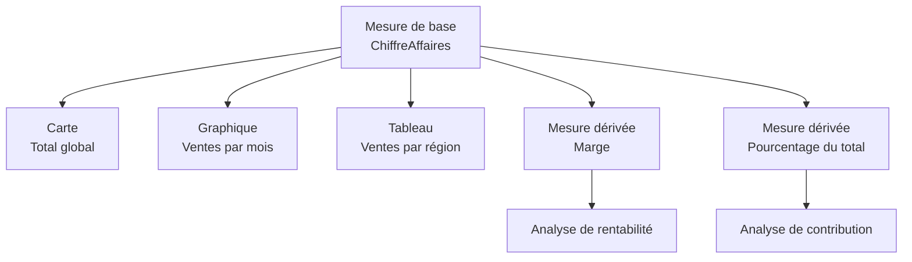

Cette capacité de réutilisation est une bonne raison de construire des mesures claires et progressives.

</details>

<p align="right"><a href="#top">↑ Retour en haut</a></p>

---

<a id="section-5"></a>

<details>
<summary>5 — Différence entre Power Query, modèle de données, DAX et visualisations</summary>

<br/>

Dans Power BI, il est essentiel de ne pas mélanger les rôles de Power Query, du modèle de données, de DAX et des visualisations. Ces quatre éléments participent au rapport, mais ils n’ont pas la même responsabilité.

Power Query prépare les données avant leur chargement dans le modèle. Il sert à nettoyer les colonnes, corriger les types, filtrer les lignes, fusionner les sources, remplacer des valeurs, transformer des dates et produire des tables propres.

Le modèle de données organise les tables et leurs relations. C’est dans le modèle que l’on relie la table `Ventes` à la table `Produits`, la table `Ventes` à la table `Clients`, et la table `Ventes` à la table `Date`.

DAX calcule les indicateurs. Il utilise les tables et les relations du modèle pour produire des mesures dynamiques et des calculs analytiques.

Les visualisations présentent les résultats. Elles affichent les mesures sous forme de graphiques, de cartes, de tableaux, de matrices ou de KPI.

La chaîne complète peut être représentée ainsi.


Cette séparation des responsabilités est importante. Une transformation qui nettoie une donnée doit généralement être faite dans Power Query. Une relation entre deux tables doit être définie dans le modèle. Un indicateur qui change selon les filtres doit généralement être écrit avec DAX. Une mise en forme visuelle doit être faite dans la page de rapport.

Voici quelques exemples pour distinguer les rôles.

| Besoin                                | Outil recommandé  | Raison                                    |
| ------------------------------------- | ----------------- | ----------------------------------------- |
| Supprimer des lignes vides            | Power Query       | Il s’agit d’une préparation de données    |
| Transformer une colonne texte en date | Power Query       | Il s’agit d’un nettoyage avant analyse    |
| Relier les ventes aux produits        | Modèle de données | Il s’agit d’une relation entre tables     |
| Calculer le chiffre d’affaires        | DAX               | Il s’agit d’un indicateur analytique      |
| Calculer un taux de marge             | DAX               | Il s’agit d’un ratio dynamique            |
| Afficher les ventes par région        | Visualisation     | Il s’agit d’une présentation du résultat  |
| Mettre un indicateur en pourcentage   | Format de mesure  | Il s’agit de la présentation de la mesure |

Une bonne architecture Power BI respecte cette logique. Elle évite de tout faire au même endroit et permet de construire des rapports plus clairs.

</details>

<p align="right"><a href="#top">↑ Retour en haut</a></p>

---

<a id="section-6"></a>

<details>
<summary>6 — Les objets DAX : mesure, colonne calculée et table calculée</summary>

<br/>

DAX peut être utilisé principalement pour créer trois types d’objets dans Power BI : les mesures, les colonnes calculées et les tables calculées. Ces trois objets utilisent le langage DAX, mais ils n’ont pas le même rôle.

Une mesure est un calcul dynamique utilisé dans les visualisations. Elle réagit aux filtres du rapport. C’est l’objet DAX le plus important dans la construction des indicateurs analytiques.

Une colonne calculée ajoute une nouvelle colonne dans une table. Elle est calculée ligne par ligne et devient une colonne stockée dans le modèle.

Une table calculée crée une nouvelle table à partir d’une expression DAX. Elle peut être utile pour produire des tables dérivées ou des structures d’analyse spécifiques.

Le diagramme suivant résume ces trois objets.

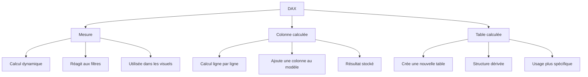

## 6.1 La mesure

Une mesure est un calcul qui s’évalue au moment où elle est utilisée dans une visualisation. Elle ne contient pas une valeur fixe. Elle produit un résultat selon le contexte.

Exemple :

```DAX
TotalVentes = SUM(Ventes[Montant])
```

Si cette mesure est utilisée dans une carte, elle peut afficher le total général des ventes. Si elle est utilisée dans un graphique par région, elle affiche le total des ventes pour chaque région. Si un filtre d’année est appliqué, elle se recalculera pour cette année.

La mesure est donc adaptée aux indicateurs de synthèse.

## 6.2 La colonne calculée

Une colonne calculée est créée dans une table et produit une valeur pour chaque ligne.

Exemple :

```DAX
MontantLigne =
Ventes[Quantité] * Ventes[PrixUnitaire]
```

Si la table contient quatre lignes, cette formule produit quatre résultats, un pour chaque ligne.

| Quantité | PrixUnitaire | MontantLigne |
| -------: | -----------: | -----------: |
|        3 |           20 |           60 |
|        2 |           50 |          100 |
|        1 |          200 |          200 |
|        5 |           20 |          100 |

La colonne calculée est utile lorsque l’on a besoin d’une information au niveau de chaque ligne, par exemple une catégorie, une clé, une étiquette ou un montant ligne par ligne.

## 6.3 La table calculée

Une table calculée crée une nouvelle table dans le modèle.

Exemple :

```DAX
ProduitsRentables =
FILTER(
    Produits,
    Produits[MargeUnitaire] > 0
)
```

Ce type d’objet doit être utilisé avec discernement. Il est utile dans certains modèles, mais il ne doit pas remplacer une bonne modélisation des données.

## 6.4 Comparaison synthétique

| Objet DAX        | Résultat produit                |          Réagit aux filtres du rapport | Usage principal                      |
| ---------------- | ------------------------------- | -------------------------------------: | ------------------------------------ |
| Mesure           | Valeur calculée dynamiquement   |                                    Oui | KPI, totaux, ratios, indicateurs     |
| Colonne calculée | Nouvelle colonne dans une table | Non, elle est calculée au niveau ligne | Valeur ligne par ligne               |
| Table calculée   | Nouvelle table dans le modèle   |       Selon sa définition et son usage | Structure dérivée ou table d’analyse |

La règle principale est la suivante : lorsqu’un indicateur doit être affiché dans un rapport et se recalculer selon les filtres, il faut généralement créer une mesure.

</details>

<p align="right"><a href="#top">↑ Retour en haut</a></p>

---

<a id="section-7"></a>

<details>
<summary>7 — Les trois types de mesures dans Power BI</summary>

<br/>

Dans Power BI, on rencontre principalement trois catégories de mesures : les mesures implicites, les mesures explicites et les mesures rapides. Ces trois catégories ne représentent pas trois langages différents, mais trois façons différentes d’obtenir ou de créer un calcul dans un rapport.

Comprendre cette distinction est important, car tous les calculs ne se valent pas en matière de clarté, de contrôle, de réutilisation et de maintenance.

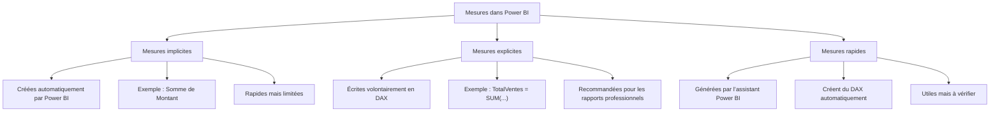

## 7.1 Les mesures implicites

Une mesure implicite est un calcul généré automatiquement par Power BI lorsqu’un champ numérique est placé dans une visualisation.

Par exemple, si la colonne `Montant` est glissée dans une carte, Power BI peut afficher automatiquement la somme de cette colonne.

```text
Somme de Montant
```

L’utilisateur n’a pas écrit de formule DAX, mais Power BI effectue quand même une agrégation.

Les mesures implicites sont pratiques pour explorer rapidement des données. Elles permettent de produire un premier visuel sans créer de mesure manuellement.

Cependant, elles ont plusieurs limites. Elles sont moins contrôlées, moins documentées, moins réutilisables et moins adaptées à des rapports professionnels complexes. Elles peuvent aussi rendre le modèle plus difficile à comprendre lorsque plusieurs visuels utilisent des agrégations automatiques différentes.

Exemple de mesure implicite :

```text
Somme de Ventes[Montant]
```

Dans ce cas, Power BI additionne la colonne `Montant`, mais la logique n’est pas formalisée dans une mesure nommée.

## 7.2 Les mesures explicites

Une mesure explicite est une mesure créée volontairement par l’auteur du rapport avec une formule DAX.

Exemple :

```DAX
TotalVentes =
SUM(Ventes[Montant])
```

Cette mesure est visible dans le modèle, peut être réutilisée dans plusieurs visualisations, peut servir de base à d’autres mesures et peut être nommée clairement.

Les mesures explicites sont recommandées pour les rapports professionnels, car elles permettent de centraliser la logique de calcul. Si la définition du total des ventes change, on modifie la mesure à un seul endroit et tous les visuels qui l’utilisent sont mis à jour.

Exemple de mesure explicite dérivée :

```DAX
Marge =
[ChiffreAffaires] - [CoutTotal]
```

Exemple de mesure explicite de ratio :

```DAX
TauxMarge =
DIVIDE(
    [Marge],
    [ChiffreAffaires],
    0
)
```

Les mesures explicites sont donc la meilleure pratique pour construire un modèle analytique lisible et maintenable.

## 7.3 Les mesures rapides

Les mesures rapides sont créées à l’aide de l’interface Power BI. L’utilisateur choisit un type de calcul dans un assistant, puis Power BI génère automatiquement une formule DAX.

Elles peuvent servir à créer rapidement certains calculs courants, comme un pourcentage du total, une différence par rapport à une période précédente, une moyenne mobile ou un total cumulé.

L’avantage des mesures rapides est qu’elles accélèrent la création de certaines formules. Elles peuvent aussi aider à observer comment Power BI écrit le DAX correspondant.

Cependant, il faut toujours vérifier le DAX généré. Une mesure rapide peut produire une formule correcte techniquement, mais pas nécessairement adaptée à la logique métier précise du rapport.

## 7.4 Comparaison des trois types de mesures

| Type de mesure   | Création             | Avantage                          | Limite                           | Usage recommandé              |
| ---------------- | -------------------- | --------------------------------- | -------------------------------- | ----------------------------- |
| Mesure implicite | Automatique          | Très rapide                       | Peu contrôlée                    | Exploration initiale          |
| Mesure explicite | Écrite en DAX        | Claire, réutilisable, maintenable | Demande une compréhension de DAX | Rapports professionnels       |
| Mesure rapide    | Générée par Power BI | Accélère certains calculs         | Doit être vérifiée               | Assistance ou point de départ |

Dans un rapport professionnel, les mesures explicites doivent être privilégiées, car elles donnent un meilleur contrôle sur la logique analytique du modèle.

</details>

<p align="right"><a href="#top">↑ Retour en haut</a></p>

---

<a id="section-8"></a>

<details>
<summary>8 — La notion centrale de contexte de calcul</summary>

<br/>

La notion de contexte est essentielle en DAX. Une mesure DAX ne produit pas toujours le même résultat, car elle dépend du contexte dans lequel elle est évaluée.

Ce contexte peut provenir d’un filtre appliqué à la page, d’un segment sélectionné par l’utilisateur, d’un graphique, d’une ligne dans un tableau, d’une colonne dans une matrice ou d’une relation entre tables.

Prenons cette mesure.

```DAX
TotalVentes =
SUM(Ventes[Montant])
```

Si elle est affichée dans une carte sans filtre, elle retourne le total général des ventes.

Si elle est affichée dans un tableau par région, elle retourne un total différent pour chaque région.

| Région   | TotalVentes |
| -------- | ----------: |
| Montréal |      40 000 |
| Québec   |      35 000 |
| Laval    |      25 000 |

La formule est identique, mais le résultat change. Ce changement s’explique par le contexte.

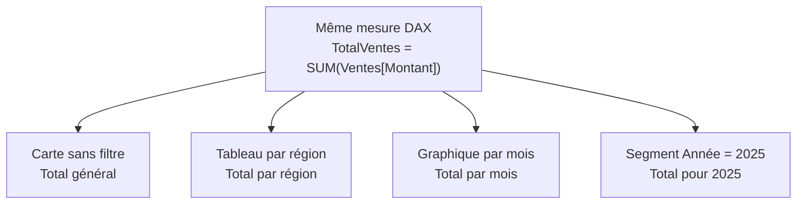

Le contexte est donc ce qui permet à une seule mesure de servir dans plusieurs situations.

Cette logique est l’une des grandes forces de Power BI. Elle permet de construire un petit nombre de mesures solides et de les réutiliser dans plusieurs pages, plusieurs graphiques et plusieurs analyses.

Sans la notion de contexte, une mesure serait une simple formule statique. Avec le contexte, elle devient un indicateur dynamique.

</details>

<p align="right"><a href="#top">↑ Retour en haut</a></p>

---

<a id="section-9"></a>

<details>
<summary>9 — Contexte de filtre, contexte de ligne et transition de contexte</summary>

<br/>

DAX repose principalement sur trois notions liées au contexte : le contexte de filtre, le contexte de ligne et la transition de contexte. Ces notions expliquent pourquoi certaines formules donnent des résultats différents selon l’endroit où elles sont utilisées.

## 9.1 Le contexte de filtre

Le contexte de filtre représente l’ensemble des filtres actifs au moment où une mesure est calculée.

Ces filtres peuvent provenir de plusieurs endroits.

Ils peuvent venir d’un segment, d’un filtre de page, d’un filtre de rapport, d’un visuel, d’une relation entre tables ou d’une expression DAX comme `CALCULATE`.

Exemple :

```DAX
TotalVentes =
SUM(Ventes[Montant])
```

Si aucun filtre n’est appliqué, cette mesure retourne le total général.

Si la page est filtrée sur l’année 2025, la mesure retourne le total des ventes de 2025.

Si un tableau affiche les ventes par région, chaque ligne du tableau applique son propre filtre de région.

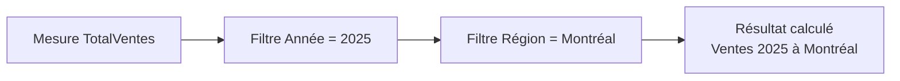

Le contexte de filtre détermine donc quelles lignes de la table sont prises en compte dans le calcul.

## 9.2 Le contexte de ligne

Le contexte de ligne apparaît lorsqu’une formule est évaluée ligne par ligne.

C’est le cas dans une colonne calculée ou dans une fonction itérative comme `SUMX`.

Exemple de colonne calculée :

```DAX
MontantLigne =
Ventes[Quantité] * Ventes[PrixUnitaire]
```

DAX prend une ligne, lit la quantité, lit le prix unitaire, calcule le montant, puis passe à la ligne suivante.

| Produit | Quantité | PrixUnitaire | MontantLigne |
| ------- | -------: | -----------: | -----------: |
| Souris  |        3 |           20 |           60 |
| Clavier |        2 |           50 |          100 |
| Écran   |        1 |          200 |          200 |

## 9.3 La transition de contexte

La transition de contexte est un concept plus avancé. Elle se produit lorsque `CALCULATE` transforme un contexte de ligne en contexte de filtre.

Ce mécanisme est important dans certains calculs avancés, notamment lorsqu’on combine des colonnes calculées, des fonctions itératives et des mesures.

Pour une première maîtrise de DAX, il faut surtout retenir que `CALCULATE` est capable de modifier le contexte de filtre. C’est pour cela que cette fonction est centrale dans DAX.

Exemple :

```DAX
VentesMontreal =
CALCULATE(
    [TotalVentes],
    Ventes[Région] = "Montréal"
)
```

Ici, `CALCULATE` force le calcul de `[TotalVentes]` dans un contexte où la région est Montréal.

## 9.4 Synthèse des contextes

| Notion                 | Signification                                               | Exemple                         |
| ---------------------- | ----------------------------------------------------------- | ------------------------------- |
| Contexte de filtre     | Ensemble des filtres actifs                                 | Année = 2025, Région = Montréal |
| Contexte de ligne      | Calcul effectué ligne par ligne                             | Quantité × PrixUnitaire         |
| Transition de contexte | Transformation d’un contexte de ligne en contexte de filtre | Usage avancé de `CALCULATE`     |

Le contexte est la raison pour laquelle DAX est plus puissant qu’une simple formule Excel. Dans Excel, une formule agit souvent cellule par cellule. Dans Power BI, une mesure agit selon l’ensemble du contexte analytique du rapport.

</details>

<p align="right"><a href="#top">↑ Retour en haut</a></p>

---

<a id="section-10"></a>

<details>
<summary>10 — Les fonctions DAX fondamentales</summary>

<br/>

Cette section présente les fonctions DAX les plus importantes pour construire des premiers indicateurs solides dans Power BI.

## 10.1 SUM

La fonction `SUM` additionne une colonne numérique.

```DAX
TotalMontant =
SUM(Ventes[Montant])
```

Elle est adaptée lorsque la colonne contient déjà les montants à additionner.

## 10.2 AVERAGE

La fonction `AVERAGE` calcule la moyenne d’une colonne numérique.

```DAX
MontantMoyen =
AVERAGE(Ventes[Montant])
```

Elle peut être utilisée pour calculer une moyenne de ventes, un prix moyen ou un coût moyen.

## 10.3 COUNT

La fonction `COUNT` compte les valeurs numériques présentes dans une colonne.

```DAX
NombreVentes =
COUNT(Ventes[Montant])
```

Elle permet de compter le nombre d’enregistrements contenant une valeur numérique.

## 10.4 COUNTA

La fonction `COUNTA` compte les valeurs non vides, y compris les valeurs texte.

```DAX
NombreProduitsRenseignes =
COUNTA(Ventes[Produit])
```

Elle est utile lorsque la colonne n’est pas numérique.

## 10.5 DISTINCTCOUNT

La fonction `DISTINCTCOUNT` compte le nombre de valeurs distinctes.

```DAX
NombreClients =
DISTINCTCOUNT(Ventes[ClientID])
```

Cette fonction est très importante pour éviter de compter plusieurs fois la même entité.

## 10.6 DIVIDE

La fonction `DIVIDE` effectue une division contrôlée.

```DAX
TauxMarge =
DIVIDE(
    [Marge],
    [ChiffreAffaires],
    0
)
```

Elle est recommandée pour les ratios et les pourcentages.

## 10.7 SUMX

La fonction `SUMX` parcourt une table ligne par ligne, calcule une expression, puis additionne les résultats.

```DAX
ChiffreAffaires =
SUMX(
    Ventes,
    Ventes[Quantité] * Ventes[PrixUnitaire]
)
```

Elle est utile lorsque le montant à additionner n’existe pas directement dans une colonne.

## 10.8 CALCULATE

La fonction `CALCULATE` modifie le contexte de filtre d’un calcul.

```DAX
VentesCanada =
CALCULATE(
    [TotalVentes],
    Clients[Pays] = "Canada"
)
```

Elle permet de calculer une mesure dans des conditions particulières.

## 10.9 ALL

La fonction `ALL` retire un filtre.

```DAX
VentesToutesRegions =
CALCULATE(
    [TotalVentes],
    ALL(Ventes[Région])
)
```

Elle est souvent utilisée pour calculer des pourcentages du total.

## 10.10 FILTER

La fonction `FILTER` retourne une table filtrée selon une condition.

```DAX
VentesImportantes =
CALCULATE(
    [TotalVentes],
    FILTER(
        Ventes,
        Ventes[Montant] > 1000
    )
)
```

Elle permet d’exprimer des conditions plus complexes.

## 10.11 IF

La fonction `IF` permet de créer une logique conditionnelle.

```DAX
StatutObjectif =
IF(
    [TotalVentes] >= [ObjectifVentes],
    "Objectif atteint",
    "Objectif non atteint"
)
```

Elle est utile pour produire des statuts lisibles dans un rapport.

## 10.12 SWITCH

La fonction `SWITCH` permet de gérer plusieurs cas.

```DAX
CategoriePerformance =
SWITCH(
    TRUE(),
    [TauxMarge] >= 0.40, "Excellente",
    [TauxMarge] >= 0.25, "Correcte",
    [TauxMarge] >= 0.10, "Faible",
    "Critique"
)
```

Cette fonction est plus lisible que plusieurs `IF` imbriqués.

</details>

<p align="right"><a href="#top">↑ Retour en haut</a></p>

---

<a id="section-11"></a>

<details>
<summary>11 — Étude de cas 1 : construire des indicateurs de ventes</summary>

<br/>

Cette étude de cas utilise une table appelée `Ventes`.

| VenteID | Date       | Produit | Région   | ClientID | Quantité | PrixUnitaire | CoutUnitaire |
| ------- | ---------- | ------- | -------- | -------- | -------: | -----------: | -----------: |
| 1       | 2025-01-01 | Souris  | Montréal | C001     |        3 |           20 |           10 |
| 2       | 2025-01-02 | Clavier | Québec   | C002     |        2 |           50 |           30 |
| 3       | 2025-01-03 | Écran   | Montréal | C001     |        1 |          200 |          150 |
| 4       | 2025-01-04 | Souris  | Laval    | C003     |        5 |           20 |           10 |

Le premier objectif consiste à créer les mesures de base.

## 11.1 Chiffre d’affaires

```DAX
ChiffreAffaires =
SUMX(
    Ventes,
    Ventes[Quantité] * Ventes[PrixUnitaire]
)
```

Cette mesure calcule le montant généré par les ventes. Elle multiplie la quantité par le prix unitaire pour chaque ligne, puis additionne les résultats.

## 11.2 Quantité vendue

```DAX
QuantiteVendue =
SUM(Ventes[Quantité])
```

Cette mesure calcule le nombre total d’unités vendues.

## 11.3 Nombre de ventes

```DAX
NombreVentes =
COUNT(Ventes[VenteID])
```

Cette mesure calcule le nombre de transactions.

## 11.4 Nombre de clients distincts

```DAX
NombreClients =
DISTINCTCOUNT(Ventes[ClientID])
```

Cette mesure compte chaque client une seule fois, même s’il apparaît dans plusieurs ventes.

## 11.5 Panier moyen

```DAX
PanierMoyen =
DIVIDE(
    [ChiffreAffaires],
    [NombreClients],
    0
)
```

Cette mesure indique le chiffre d’affaires moyen généré par client.

## 11.6 Lecture analytique

Avec ces mesures, le rapport commence déjà à dépasser le simple affichage des données. Il devient possible de savoir combien l’entreprise a vendu, combien d’unités ont été vendues, combien de transactions ont été enregistrées, combien de clients distincts ont acheté, et combien chaque client rapporte en moyenne.

Le modèle analytique peut être représenté ainsi.

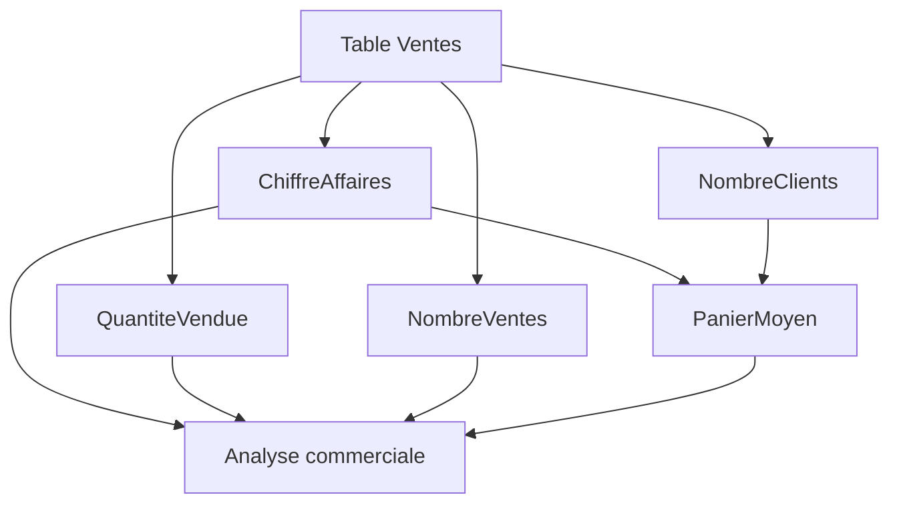

</details>

<p align="right"><a href="#top">↑ Retour en haut</a></p>

---

<a id="section-12"></a>

<details>
<summary>12 — Étude de cas 2 : marge, rentabilité et performance commerciale</summary>

<br/>

Afficher uniquement les ventes peut conduire à une mauvaise interprétation. Une entreprise peut vendre beaucoup, mais avec des coûts élevés. Dans ce cas, le chiffre d’affaires peut sembler bon, alors que la rentabilité est faible.

Il faut donc ajouter des indicateurs de coût et de marge.

## 12.1 Coût total

```DAX
CoutTotal =
SUMX(
    Ventes,
    Ventes[Quantité] * Ventes[CoutUnitaire]
)
```

Cette mesure calcule le coût total des produits vendus.

## 12.2 Marge

```DAX
Marge =
[ChiffreAffaires] - [CoutTotal]
```

Cette mesure calcule ce qui reste après avoir retiré les coûts du chiffre d’affaires.

## 12.3 Taux de marge

```DAX
TauxMarge =
DIVIDE(
    [Marge],
    [ChiffreAffaires],
    0
)
```

Cette mesure exprime la marge en pourcentage du chiffre d’affaires.

## 12.4 Statut de rentabilité

```DAX
StatutRentabilite =
SWITCH(
    TRUE(),
    [TauxMarge] >= 0.40, "Rentabilité élevée",
    [TauxMarge] >= 0.25, "Rentabilité correcte",
    [TauxMarge] >= 0.10, "Rentabilité faible",
    "Rentabilité critique"
)
```

Cette mesure permet de transformer un résultat numérique en lecture qualitative.

## 12.5 Exemple d’interprétation

| Produit | ChiffreAffaires | CoutTotal | Marge | TauxMarge | StatutRentabilite    |
| ------- | --------------: | --------: | ----: | --------: | -------------------- |
| Souris  |             160 |        80 |    80 |      50 % | Rentabilité élevée   |
| Clavier |             100 |        60 |    40 |      40 % | Rentabilité élevée   |
| Écran   |             200 |       150 |    50 |      25 % | Rentabilité correcte |

Ce tableau montre que le produit qui génère le plus de chiffre d’affaires n’est pas nécessairement celui qui offre la meilleure rentabilité relative. C’est précisément ce type d’analyse que DAX permet de construire.

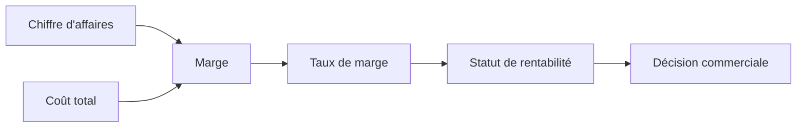

</details>

<p align="right"><a href="#top">↑ Retour en haut</a></p>

---

<a id="section-13"></a>

<details>
<summary>13 — Étude de cas 3 : pourcentage du total et contribution régionale</summary>

<br/>

Un rapport analytique doit souvent montrer la contribution d’un élément au total. Il ne suffit pas de savoir qu’une région a généré 40 000 dollars de ventes. Il faut aussi savoir ce que ces 40 000 dollars représentent par rapport au total général.

## 13.1 Mesure du total général

```DAX
ChiffreAffairesToutesRegions =
CALCULATE(
    [ChiffreAffaires],
    ALL(Ventes[Région])
)
```

Cette mesure calcule le chiffre d’affaires en ignorant le filtre sur la région.

## 13.2 Part de chaque région

```DAX
PartRegion =
DIVIDE(
    [ChiffreAffaires],
    [ChiffreAffairesToutesRegions],
    0
)
```

Cette mesure divise le chiffre d’affaires de la région actuelle par le chiffre d’affaires total de toutes les régions.

## 13.3 Exemple de résultat

| Région   | ChiffreAffaires | PartRegion |
| -------- | --------------: | ---------: |
| Montréal |          40 000 |       40 % |
| Québec   |          35 000 |       35 % |
| Laval    |          25 000 |       25 % |

Cette analyse permet de comprendre le poids relatif de chaque région.

## 13.4 Schéma du calcul

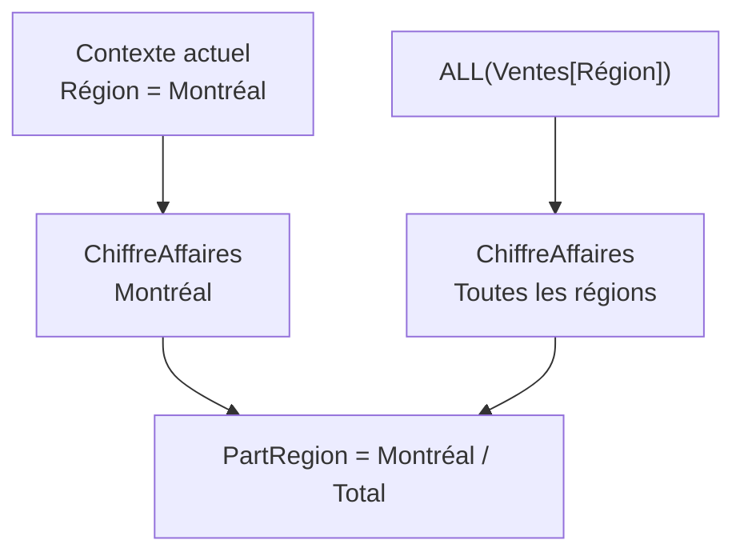

Le point important est que le numérateur respecte le contexte actuel, tandis que le dénominateur retire le filtre sur la région pour obtenir le total général.

Cette logique est très utilisée dans les tableaux de bord commerciaux, financiers et opérationnels.

</details>

<p align="right"><a href="#top">↑ Retour en haut</a></p>

---

<a id="section-14"></a>

<details>
<summary>14 — Étude de cas 4 : comparaison temporelle et évolution annuelle</summary>

<br/>

Les comparaisons temporelles sont très importantes dans les rapports Power BI. Il est fréquent de devoir comparer les ventes actuelles avec les ventes du mois précédent, de l’année précédente ou d’une période équivalente.

Pour réaliser correctement ce type d’analyse, il est recommandé d’utiliser une table de dates dans le modèle Power BI.

## 14.1 Table de dates simple

Une table de dates peut contenir les colonnes suivantes.

| Date       | Année | Mois | NomMois | Trimestre |
| ---------- | ----: | ---: | ------- | --------- |
| 2025-01-01 |  2025 |    1 | Janvier | T1        |
| 2025-01-02 |  2025 |    1 | Janvier | T1        |

La table `Date` doit être reliée à la table `Ventes`.

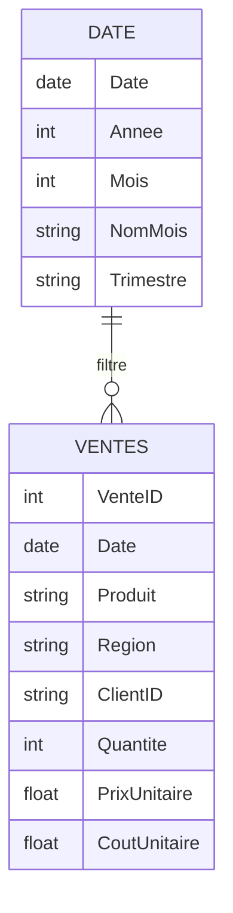

## 14.2 Ventes de l’année précédente

```DAX
VentesAnneePrecedente =
CALCULATE(
    [ChiffreAffaires],
    SAMEPERIODLASTYEAR('Date'[Date])
)
```

Cette mesure calcule le chiffre d’affaires de la même période l’année précédente.

## 14.3 Croissance en valeur

```DAX
CroissanceValeur =
[ChiffreAffaires] - [VentesAnneePrecedente]
```

Cette mesure indique l’écart en valeur entre la période actuelle et la période précédente.

## 14.4 Croissance en pourcentage

```DAX
CroissancePourcentage =
DIVIDE(
    [CroissanceValeur],
    [VentesAnneePrecedente],
    0
)
```

Cette mesure indique l’évolution relative entre les deux périodes.

## 14.5 Exemple d’interprétation

| Année | ChiffreAffaires | VentesAnneePrecedente | CroissanceValeur | CroissancePourcentage |
| ----: | --------------: | --------------------: | ---------------: | --------------------: |
|  2025 |         120 000 |               100 000 |           20 000 |                  20 % |

Ce tableau indique que les ventes ont augmenté de 20 000 dollars, ce qui représente une croissance de 20 % par rapport à l’année précédente.

## 14.6 Schéma de comparaison temporelle

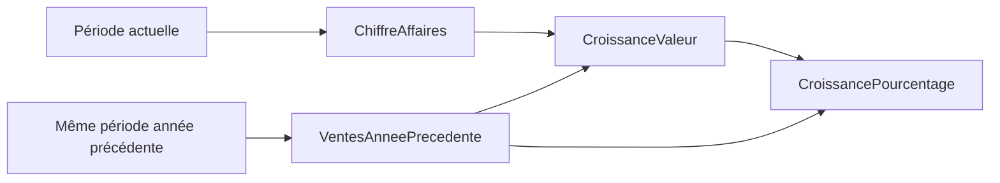

Ce type de mesure transforme un rapport descriptif en rapport de suivi de performance.

</details>

<p align="right"><a href="#top">↑ Retour en haut</a></p>

---

<a id="section-15"></a>

<details>
<summary>15 — Organisation professionnelle des mesures DAX</summary>

<br/>

Lorsque le nombre de mesures augmente dans un rapport, il devient nécessaire de les organiser clairement. Une mauvaise organisation rend le modèle difficile à comprendre et augmente le risque d’erreurs.

Une bonne pratique consiste à créer des mesures de base, puis des mesures dérivées.

Les mesures de base correspondent aux premiers calculs fondamentaux.

```DAX
ChiffreAffaires =
SUMX(
    Ventes,
    Ventes[Quantité] * Ventes[PrixUnitaire]
)
```

```DAX
CoutTotal =
SUMX(
    Ventes,
    Ventes[Quantité] * Ventes[CoutUnitaire]
)
```

Les mesures dérivées s’appuient sur les mesures de base.

```DAX
Marge =
[ChiffreAffaires] - [CoutTotal]
```

```DAX
TauxMarge =
DIVIDE(
    [Marge],
    [ChiffreAffaires],
    0
)
```

Les mesures d’analyse vont encore plus loin.

```DAX
PartRegion =
DIVIDE(
    [ChiffreAffaires],
    CALCULATE(
        [ChiffreAffaires],
        ALL(Ventes[Région])
    ),
    0
)
```

Le schéma suivant montre cette hiérarchie.

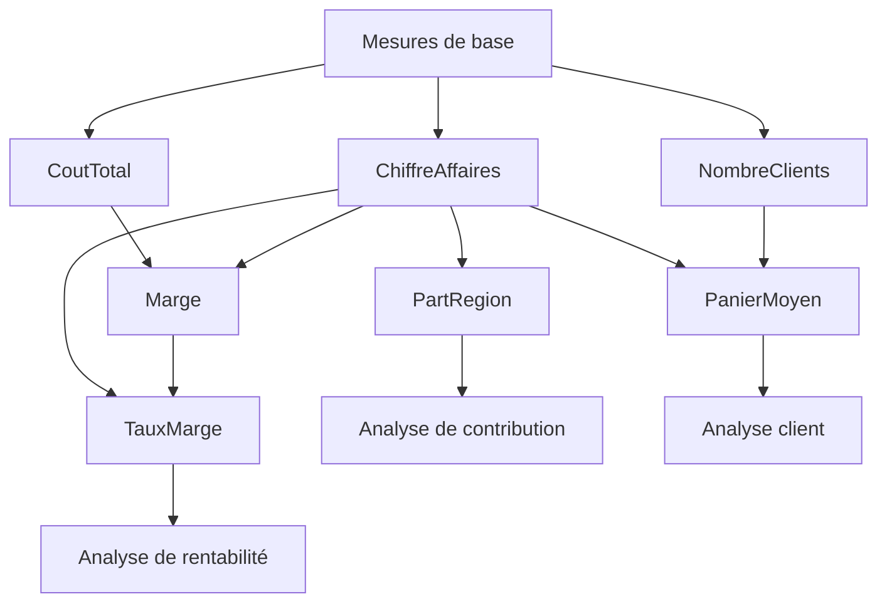

## 15.1 Convention de nommage

Les noms des mesures doivent être explicites. Un nom clair facilite la lecture du modèle.

Exemples recommandés :

```text
ChiffreAffaires
CoutTotal
Marge
TauxMarge
NombreClients
PanierMoyen
PartRegion
CroissancePourcentage
```

Exemples à éviter :

```text
Mesure1
Calcul2
Total
Pourcentage
Test
```

## 15.2 Regrouper les mesures

Dans les modèles plus grands, il est possible de créer une table dédiée aux mesures. Cette table ne contient pas nécessairement de données métier. Elle sert uniquement à regrouper les mesures dans un endroit logique.

Exemple de table :

```text
_Mesures
```

Cette organisation facilite la navigation dans le modèle Power BI.

## 15.3 Construire progressivement

Il est préférable d’écrire des mesures simples, puis de les réutiliser. Cette approche est plus claire que de créer une formule très longue qui répète plusieurs fois les mêmes calculs.

Au lieu d’écrire une seule mesure complexe pour le taux de marge, il est préférable de créer :

```text
ChiffreAffaires
CoutTotal
Marge
TauxMarge
```

Cette structure permet de tester chaque étape séparément.

</details>

<p align="right"><a href="#top">↑ Retour en haut</a></p>

---

<a id="section-16"></a>

<details>
<summary>16 — Erreurs fréquentes et corrections recommandées</summary>

<br/>

Cette section présente plusieurs erreurs fréquentes lors de la création de mesures DAX et explique comment les corriger.

## 16.1 Utiliser uniquement des mesures implicites

Les mesures implicites sont pratiques pour explorer rapidement les données, mais elles ne sont pas recommandées comme base d’un rapport professionnel.

Au lieu de laisser Power BI afficher automatiquement :

```text
Somme de Montant
```

il est préférable de créer une mesure explicite.

```DAX
TotalVentes =
SUM(Ventes[Montant])
```

Cette mesure est nommée, réutilisable et contrôlée.

## 16.2 Créer trop de colonnes calculées

Une colonne calculée n’est pas toujours le meilleur choix. Si le calcul doit changer selon les filtres du rapport, il faut créer une mesure.

Exemple à éviter si l’objectif est un indicateur dynamique :

```DAX
MontantLigne =
Ventes[Quantité] * Ventes[PrixUnitaire]
```

Cette colonne peut être utile, mais pour calculer le chiffre d’affaires total de manière dynamique, une mesure est souvent préférable.

```DAX
ChiffreAffaires =
SUMX(
    Ventes,
    Ventes[Quantité] * Ventes[PrixUnitaire]
)
```

## 16.3 Diviser avec `/` sans gérer les zéros

Une division directe peut produire des problèmes lorsque le dénominateur est égal à zéro.

À éviter :

```DAX
TauxMarge =
[Marge] / [ChiffreAffaires]
```

Recommandé :

```DAX
TauxMarge =
DIVIDE(
    [Marge],
    [ChiffreAffaires],
    0
)
```

## 16.4 Ne pas tester une mesure dans plusieurs contextes

Une mesure doit être testée dans une carte, dans un tableau, dans un graphique et avec des segments. Cela permet de vérifier qu’elle réagit correctement aux filtres.

## 16.5 Créer une formule trop longue dès le départ

Une formule longue est plus difficile à lire, à tester et à corriger. Il est préférable de décomposer le calcul en plusieurs mesures.

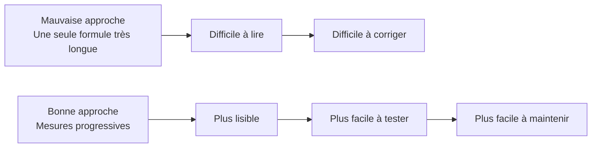

## 16.6 Oublier le format des mesures

Une mesure de taux doit être formatée en pourcentage. Une mesure financière doit être formatée en devise. Une mesure de quantité peut être formatée en nombre entier.

Le format ne change pas le calcul, mais il améliore la lecture du rapport.

</details>

<p align="right"><a href="#top">↑ Retour en haut</a></p>

---

<a id="section-17"></a>

<details>
<summary>17 — Synthèse finale</summary>

<br/>

DAX est le langage analytique de Power BI. Il permet de créer des calculs qui transforment les données brutes en indicateurs exploitables.

Power BI peut être utilisé sans écrire de DAX pour créer des rapports simples. Il peut importer des données, produire des graphiques et appliquer des agrégations automatiques. Toutefois, ces possibilités deviennent limitées lorsque le rapport doit répondre à des questions métier précises.

DAX devient nécessaire lorsque l’on souhaite calculer un chiffre d’affaires, une marge, un taux de marge, un panier moyen, un pourcentage du total, une croissance annuelle, un écart budgétaire ou un indicateur de performance.

Il faut distinguer les mesures, les colonnes calculées et les tables calculées. Une mesure est dynamique et réagit aux filtres du rapport. Une colonne calculée produit une valeur ligne par ligne. Une table calculée crée une nouvelle table dans le modèle.

Il faut également distinguer les mesures implicites, les mesures explicites et les mesures rapides. Les mesures implicites sont générées automatiquement par Power BI. Les mesures explicites sont écrites volontairement en DAX et représentent la meilleure pratique pour les rapports professionnels. Les mesures rapides peuvent aider, mais elles doivent être vérifiées.

La notion de contexte est centrale. Une mesure DAX ne calcule jamais dans le vide. Elle calcule selon les filtres actifs, les segments sélectionnés, les lignes d’un tableau, les colonnes d’une matrice et les relations du modèle.

Le schéma final suivant résume le rôle de DAX dans Power BI.

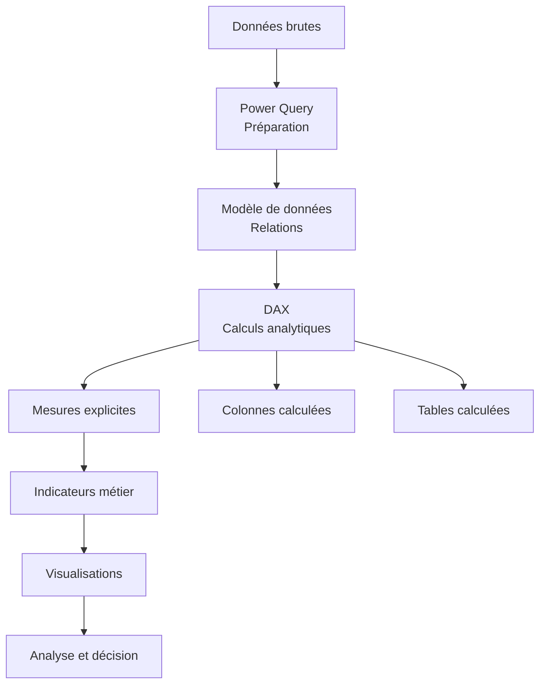

La phrase essentielle à retenir est la suivante.

```text
Power Query prépare les données.
Le modèle de données organise les tables.
DAX calcule les indicateurs.
Power BI présente les résultats.
```

Un rapport Power BI professionnel ne doit pas seulement afficher des chiffres. Il doit permettre d’interpréter ces chiffres. Il doit expliquer une performance, mesurer des écarts, comparer des périodes, identifier des contributions et soutenir la décision.

DAX est l’élément qui permet de construire cette couche analytique dans Power BI.

</details>

<p align="right"><a href="#top">↑ Retour en haut</a></p>

