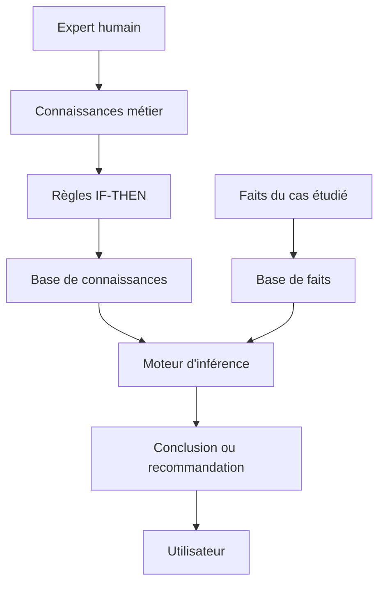
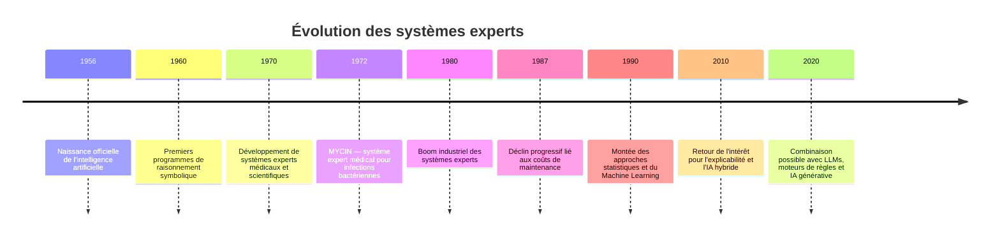
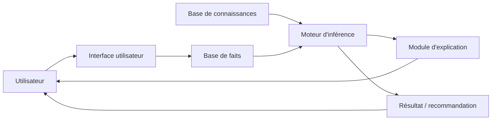
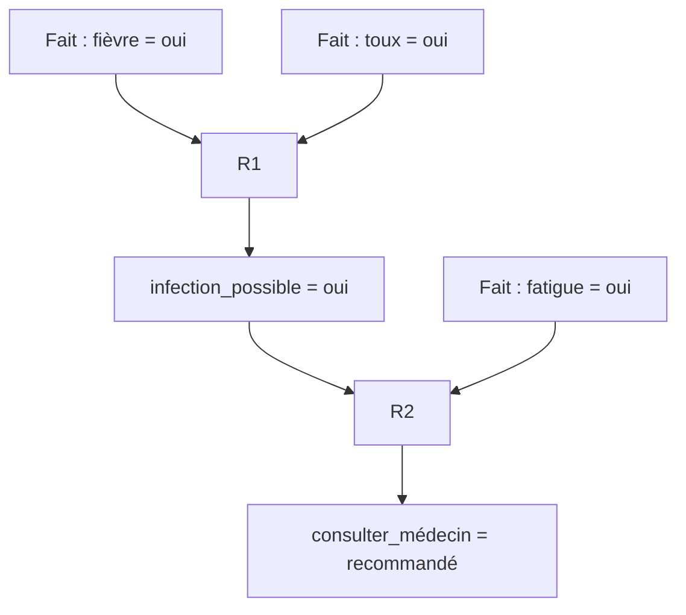
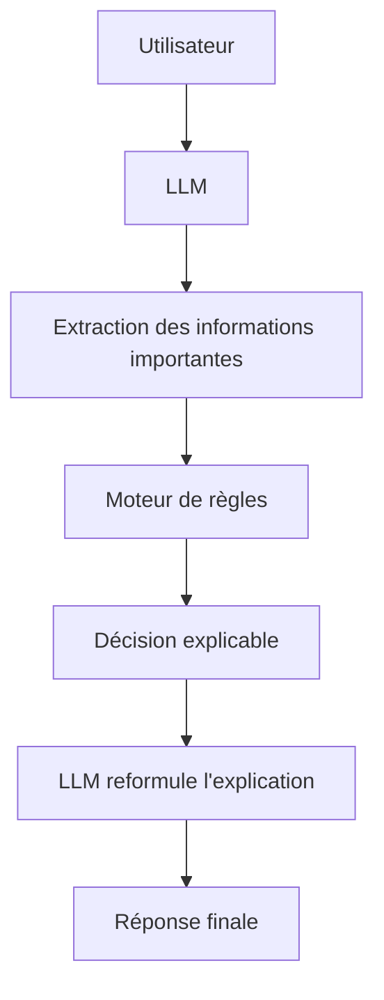

<a id="top"></a>

# Systèmes experts : principes, fonctionnement et exercices

## Table des matières

| #  | Section                                                                                  |
| -- | ---------------------------------------------------------------------------------------- |
| 1  | [Présentation du cours](#section-1)                                                      |
| 2  | [Qu'est-ce qu'un système expert ?](#section-2)                                           |
| 2a |    ↳ [Définition simple](#section-2)                                                     |
| 2b |    ↳ [Différence avec l'IA moderne](#section-2)                                          |
| 3  | [Pourquoi les systèmes experts ont été importants dans l'histoire de l'IA ?](#section-3) |
| 4  | [Architecture d'un système expert](#section-4)                                           |
| 4a |    ↳ [Base de connaissances](#section-4)                                                 |
| 4b |    ↳ [Base de faits](#section-4)                                                         |
| 4c |    ↳ [Moteur d'inférence](#section-4)                                                    |
| 4d |    ↳ [Interface utilisateur](#section-4)                                                 |
| 5  | [Règles IF-THEN et raisonnement logique](#section-5)                                     |
| 6  | [Chaînage avant et chaînage arrière](#section-6)                                         |
| 7  | [Exemples concrets de systèmes experts](#section-7)                                      |
| 8  | [Avantages et limites](#section-8)                                                       |
| 9  | [Systèmes experts vs Machine Learning vs LLM](#section-9)                                |
| 10 | [Activité guidée — Construire un mini système expert](#section-10)                       |
| 11 | [Exercices individuels](#section-11)                                                     |
| 12 | [Travail de groupe — Concevoir un système expert métier](#section-12)                    |
| 13 | [Mini-évaluation](#section-13)                                                           |

---

<a id="section-1"></a>

<details>
<summary><strong>1 — Présentation du cours</strong></summary>

<br/>

Ce cours présente les **systèmes experts**, une famille historique de l'intelligence artificielle basée sur des règles explicites, des connaissances humaines et un raisonnement logique.

Avant l'explosion du Machine Learning, du Deep Learning et des grands modèles de langage, les systèmes experts représentaient l'une des approches les plus importantes de l'IA en entreprise.

L'objectif de ce cours est de comprendre comment une machine peut raisonner à partir de règles écrites par des humains, comme le ferait un expert dans un domaine précis.

---

### Objectifs du cours

À la fin de ce cours, vous serez capable de :

* Définir ce qu'est un système expert
* Expliquer le rôle d'une base de connaissances
* Comprendre le fonctionnement d'un moteur d'inférence
* Distinguer le chaînage avant et le chaînage arrière
* Écrire des règles simples de type IF-THEN
* Comparer un système expert avec le Machine Learning et les LLMs
* Concevoir un petit système expert pour un problème métier simple

---

### Idée centrale du cours

Un système expert ne « devine » pas à partir de milliers de données. Il applique des règles définies par des humains.

Exemple très simple :

```text
SI le client a un revenu élevé
ET le client a un bon historique de crédit
ALORS le prêt peut être accepté.
```

Le système applique donc une logique explicite. Il ne découvre pas automatiquement les règles : les règles doivent être écrites, validées et maintenues.

---

### Vue d'ensemble



</details>

<p align="right"><a href="#top">↑ Retour en haut</a></p>

---

<a id="section-2"></a>

<details>
<summary><strong>2 — Qu'est-ce qu'un système expert ?</strong></summary>

<br/>

### Définition simple

Un **système expert** est un programme informatique qui tente de reproduire le raisonnement d'un expert humain dans un domaine précis.

Il utilise généralement :

* Une **base de connaissances** : ensemble de règles et d'informations métier
* Une **base de faits** : informations connues sur le cas à analyser
* Un **moteur d'inférence** : mécanisme qui applique les règles aux faits
* Une **interface utilisateur** : espace où l'utilisateur saisit des informations et reçoit une conclusion

---

### Exemple simple

Dans un système expert médical simplifié :

```text
Fait 1 : le patient a de la fièvre.
Fait 2 : le patient tousse.
Fait 3 : le patient a mal à la gorge.

Règle :
SI fièvre ET toux ET mal de gorge
ALORS suspicion d'infection respiratoire.
```

Le système ne remplace pas un médecin. Il aide à organiser un raisonnement logique à partir de symptômes.

---

### Définition professionnelle

Un système expert est une application d'IA symbolique qui utilise des connaissances explicites, représentées sous forme de règles, pour résoudre des problèmes nécessitant normalement l'expertise d'un spécialiste humain.

---

### Différence avec l'IA moderne

| Approche             | Principe                                              | Exemple                                    |
| -------------------- | ----------------------------------------------------- | ------------------------------------------ |
| **Système expert**   | Utilise des règles écrites par des humains            | Diagnostic simple, aide à la décision      |
| **Machine Learning** | Apprend à partir de données                           | Détection de fraude à partir d'historiques |
| **Deep Learning**    | Apprend à partir de très grandes quantités de données | Reconnaissance d'images                    |
| **LLM**              | Génère du texte à partir de modèles de langage        | ChatGPT, Claude, Gemini                    |

---

### À retenir

Un système expert est particulièrement utile lorsque :

* Le domaine est bien défini
* Les règles sont connues
* Les décisions doivent être explicables
* Les données historiques sont limitées
* L'organisation veut reproduire un raisonnement métier clair

</details>

<p align="right"><a href="#top">↑ Retour en haut</a></p>

---

<a id="section-3"></a>

<details>
<summary><strong>3 — Pourquoi les systèmes experts ont été importants dans l'histoire de l'IA ?</strong></summary>

<br/>

Les systèmes experts ont marqué une période très importante de l'histoire de l'intelligence artificielle, surtout dans les années 1970 et 1980.

À cette époque, les ordinateurs n'avaient pas la puissance actuelle et les grandes bases de données n'étaient pas aussi disponibles qu'aujourd'hui. Les chercheurs ont donc développé une IA basée sur la logique, les règles et les connaissances humaines.

---

### Chronologie simplifiée



---

### Exemples historiques connus

| Système        | Domaine      | Rôle                                               |
| -------------- | ------------ | -------------------------------------------------- |
| **DENDRAL**    | Chimie       | Aider à identifier des structures moléculaires     |
| **MYCIN**      | Médecine     | Aider au diagnostic d'infections bactériennes      |
| **XCON**       | Informatique | Configurer des systèmes informatiques chez DEC     |
| **PROSPECTOR** | Géologie     | Aider à identifier des zones minières prometteuses |

---

### Pourquoi ces systèmes ont eu du succès ?

Ils ont montré qu'un ordinateur pouvait utiliser des règles spécialisées pour produire des recommandations proches de celles d'un expert humain dans un domaine limité.

---

### Pourquoi ils ont décliné ?

Plusieurs raisons expliquent leur déclin relatif :

* Les règles étaient longues à écrire
* Les connaissances devenaient difficiles à maintenir
* Les systèmes étaient rigides
* Ils géraient mal les situations ambiguës
* Ils ne pouvaient pas apprendre automatiquement à partir de nouvelles données
* Le coût de développement était élevé

</details>

<p align="right"><a href="#top">↑ Retour en haut</a></p>

---

<a id="section-4"></a>

<details>
<summary><strong>4 — Architecture d'un système expert</strong></summary>

<br/>

Un système expert est composé de plusieurs éléments qui travaillent ensemble pour produire une conclusion.

---

### Architecture générale



---

### 1. Base de connaissances

La **base de connaissances** contient les règles métier du système. Ces règles sont souvent écrites avec des structures de type :

```text
SI condition
ALORS conclusion
```

Exemple :

```text
SI température > 38
ET toux = oui
ALORS suspicion_grippe = possible
```

La base de connaissances représente ce que l'expert sait.

---

### 2. Base de faits

La **base de faits** contient les informations connues pour un cas précis.

Exemple :

```text
patient_température = 39
patient_toux = oui
patient_fatigue = oui
```

La base de faits représente la situation actuelle à analyser.

---

### 3. Moteur d'inférence

Le **moteur d'inférence** est le cœur du système expert. Il compare les faits avec les règles disponibles et déclenche les règles applicables.

Exemple :

```text
Faits connus :
- température > 38
- toux = oui

Règle disponible :
SI température > 38 ET toux = oui
ALORS suspicion_grippe = possible

Conclusion :
suspicion_grippe = possible
```

---

### 4. Module d'explication

Un bon système expert doit pouvoir expliquer son raisonnement.

Exemple :

```text
Le système recommande une vérification médicale,
car les faits suivants ont été observés :
- température élevée
- toux présente
- fatigue importante

Ces faits correspondent à la règle R3.
```

Ce point est très important, car les systèmes experts sont souvent utilisés dans des domaines où il faut justifier les décisions.

---

### 5. Interface utilisateur

L'interface permet à l'utilisateur de :

* Entrer les faits
* Répondre à des questions
* Recevoir une recommandation
* Comprendre pourquoi cette recommandation a été produite

</details>

<p align="right"><a href="#top">↑ Retour en haut</a></p>

---

<a id="section-5"></a>

<details>
<summary><strong>5 — Règles IF-THEN et raisonnement logique</strong></summary>

<br/>

Les règles IF-THEN sont la base de nombreux systèmes experts.

---

### Structure d'une règle

```text
SI condition 1
ET condition 2
ALORS conclusion
```

ou :

```text
SI condition 1
OU condition 2
ALORS conclusion
```

---

### Exemple 1 — Diagnostic informatique

```text
SI l'ordinateur ne démarre pas
ET le voyant d'alimentation est éteint
ALORS vérifier le câble d'alimentation.
```

---

### Exemple 2 — Support technique réseau

```text
SI l'utilisateur n'a pas Internet
ET l'adresse IP commence par 169.254
ALORS problème probable avec le serveur DHCP.
```

---

### Exemple 3 — Décision bancaire simplifiée

```text
SI revenu_mensuel > 4000
ET historique_credit = bon
ET dettes = faibles
ALORS prêt_acceptable = oui.
```

---

### Exemple 4 — Orientation pédagogique

```text
SI l'étudiant échoue aux exercices de base
ET l'étudiant ne comprend pas les définitions
ALORS recommander une séance de révision.
```

---

### Attention aux règles trop générales

Une mauvaise règle serait :

```text
SI étudiant a une mauvaise note
ALORS étudiant ne travaille pas.
```

Cette règle est dangereuse, car elle ignore d'autres causes possibles : stress, maladie, incompréhension, problème personnel, manque de temps, consignes mal comprises.

Une meilleure règle serait :

```text
SI étudiant a une mauvaise note
ET exercices non remis
ET absences fréquentes
ALORS risque de difficulté académique élevé.
```

---

### Exemple de base de règles complète

```text
R1 : SI fièvre = oui ET toux = oui ALORS infection_possible = oui
R2 : SI infection_possible = oui ET fatigue = oui ALORS consulter_medecin = recommandé
R3 : SI douleur_poitrine = oui ALORS urgence = oui
R4 : SI urgence = oui ALORS appeler_service_urgence = recommandé
```

</details>

<p align="right"><a href="#top">↑ Retour en haut</a></p>

---

<a id="section-6"></a>

<details>
<summary><strong>6 — Chaînage avant et chaînage arrière</strong></summary>

<br/>

Le moteur d'inférence peut raisonner de plusieurs façons. Les deux méthodes les plus classiques sont le **chaînage avant** et le **chaînage arrière**.

---

## 6.1 Chaînage avant

Le **chaînage avant** part des faits connus et applique les règles pour arriver à une conclusion.

Il répond à la logique suivante :

```text
Voici ce que je sais.
Qu'est-ce que je peux déduire ?
```

---

### Exemple

Faits connus :

```text
fièvre = oui
toux = oui
fatigue = oui
```

Règles :

```text
R1 : SI fièvre = oui ET toux = oui ALORS infection_possible = oui
R2 : SI infection_possible = oui ET fatigue = oui ALORS consulter_medecin = recommandé
```

Raisonnement :

```text
Étape 1 : fièvre = oui et toux = oui → R1 s'applique
Conclusion intermédiaire : infection_possible = oui

Étape 2 : infection_possible = oui et fatigue = oui → R2 s'applique
Conclusion finale : consulter_medecin = recommandé
```

---

### Représentation



---

## 6.2 Chaînage arrière

Le **chaînage arrière** part d'une hypothèse ou d'un objectif, puis cherche les faits nécessaires pour confirmer cette hypothèse.

Il répond à la logique suivante :

```text
Je veux prouver cette conclusion.
Quelles conditions doivent être vraies ?
```

---

### Exemple

Objectif :

```text
Prouver : consulter_medecin = recommandé
```

Règle liée :

```text
R2 : SI infection_possible = oui ET fatigue = oui ALORS consulter_medecin = recommandé
```

Le système doit donc vérifier :

```text
infection_possible = oui ?
fatigue = oui ?
```

Pour prouver infection_possible :

```text
R1 : SI fièvre = oui ET toux = oui ALORS infection_possible = oui
```

Le système demande donc :

```text
Le patient a-t-il de la fièvre ?
Le patient tousse-t-il ?
Le patient est-il fatigué ?
```

---

### Différence entre les deux

| Critère             | Chaînage avant                   | Chaînage arrière                   |
| ------------------- | -------------------------------- | ---------------------------------- |
| Point de départ     | Les faits                        | L'objectif                         |
| Question principale | Que peut-on conclure ?           | Comment prouver cette conclusion ? |
| Style               | Exploratoire                     | Dirigé par un but                  |
| Exemple             | Diagnostic à partir de symptômes | Vérifier une hypothèse précise     |

---

### Résumé simple

```text
Chaînage avant : faits → règles → conclusions
Chaînage arrière : conclusion visée → règles nécessaires → faits à vérifier
```

</details>

<p align="right"><a href="#top">↑ Retour en haut</a></p>

---

<a id="section-7"></a>

<details>
<summary><strong>7 — Exemples concrets de systèmes experts</strong></summary>

<br/>

Les systèmes experts peuvent être utilisés dans de nombreux domaines où les décisions reposent sur des règles claires.

---

### Exemple 1 — Diagnostic informatique

Un service technique peut utiliser un système expert pour aider à résoudre les pannes courantes.

```text
SI l'ordinateur ne démarre pas
ET aucun voyant n'est allumé
ALORS vérifier l'alimentation.

SI l'ordinateur démarre
ET aucun affichage n'apparaît
ALORS vérifier l'écran ou le câble vidéo.

SI Internet ne fonctionne pas
ET l'adresse IP commence par 169.254
ALORS vérifier le serveur DHCP ou la connexion réseau.
```

---

### Exemple 2 — Banque

Un système expert peut aider à préanalyser une demande de prêt.

```text
SI revenu stable = oui
ET historique de crédit = bon
ET ratio d'endettement < 35 %
ALORS risque faible.

SI revenu instable = oui
OU historique de crédit = mauvais
ALORS risque élevé.
```

---

### Exemple 3 — Assurance

```text
SI accident déclaré rapidement
ET photos fournies
ET contrat actif
ALORS dossier recevable.

SI contrat expiré
ALORS dossier non recevable.
```

---

### Exemple 4 — Ressources humaines

```text
SI candidat possède diplôme requis
ET expérience >= 3 ans
ET compétences techniques validées
ALORS candidat admissible à l'entrevue technique.
```

---

### Exemple 5 — Cybersécurité

```text
SI plusieurs tentatives de connexion échouées
ET adresse IP inconnue
ET connexion depuis un pays inhabituel
ALORS risque d'attaque par force brute.
```

---

### Exemple 6 — Éducation

```text
SI étudiant absent plus de 3 fois
ET travaux non remis
ET note inférieure à 60 %
ALORS risque d'échec élevé.
```

---

### Domaines d'application

| Domaine       | Exemple de décision         |
| ------------- | --------------------------- |
| Médecine      | Aide au diagnostic          |
| Finance       | Évaluation du risque        |
| Assurance     | Analyse de réclamations     |
| Informatique  | Support technique           |
| Cybersécurité | Détection d'incidents       |
| Éducation     | Suivi des étudiants         |
| Industrie     | Diagnostic de panne machine |
| Juridique     | Vérification de conformité  |

</details>

<p align="right"><a href="#top">↑ Retour en haut</a></p>

---

<a id="section-8"></a>

<details>
<summary><strong>8 — Avantages et limites</strong></summary>

<br/>

Les systèmes experts ont des avantages importants, mais aussi des limites qui expliquent pourquoi ils ne sont pas suffisants pour tous les problèmes d'IA.

---

### Avantages

| Avantage                            | Explication                                                |
| ----------------------------------- | ---------------------------------------------------------- |
| **Explicabilité**                   | Le système peut expliquer quelle règle a été utilisée.     |
| **Contrôle**                        | Les règles sont écrites et validées par des humains.       |
| **Cohérence**                       | Le système applique toujours les mêmes règles.             |
| **Utile avec peu de données**       | Il n'a pas besoin de milliers d'exemples pour fonctionner. |
| **Adapté aux domaines réglementés** | Les décisions peuvent être justifiées.                     |
| **Capitalisation du savoir**        | Les connaissances d'un expert peuvent être conservées.     |

---

### Limites

| Limite                                     | Explication                                                |
| ------------------------------------------ | ---------------------------------------------------------- |
| **Rigidité**                               | Le système ne s'adapte pas facilement aux cas nouveaux.    |
| **Maintenance difficile**                  | Plus il y a de règles, plus il est difficile de les gérer. |
| **Acquisition des connaissances coûteuse** | Il faut interroger des experts et formaliser leur savoir.  |
| **Pas d'apprentissage automatique**        | Le système ne découvre pas les règles seul.                |
| **Risque de conflits entre règles**        | Deux règles peuvent mener à des conclusions opposées.      |
| **Difficulté avec l'incertitude**          | Les situations ambiguës sont difficiles à traiter.         |

---

### Exemple de conflit entre règles

```text
R1 : SI revenu > 4000 ET historique_credit = bon ALORS prêt = accepté
R2 : SI dettes = élevées ALORS prêt = refusé
```

Cas du client :

```text
revenu = 5000
historique_credit = bon
dettes = élevées
```

Le système peut obtenir deux conclusions contradictoires :

```text
prêt = accepté
prêt = refusé
```

Il faut donc ajouter une stratégie de priorité :

```text
SI dettes = élevées
ALORS appliquer la règle de refus avant les autres règles.
```

---

### À retenir

Les systèmes experts sont puissants lorsque les règles sont claires, mais ils deviennent fragiles lorsque le domaine est complexe, incertain ou en évolution rapide.

</details>

<p align="right"><a href="#top">↑ Retour en haut</a></p>

---

<a id="section-9"></a>

<details>
<summary><strong>9 — Systèmes experts vs Machine Learning vs LLM</strong></summary>

<br/>

Il est important de ne pas confondre les systèmes experts avec le Machine Learning ou les grands modèles de langage.

---

### Comparaison générale

| Critère                | Système expert        | Machine Learning       | LLM                                               |
| ---------------------- | --------------------- | ---------------------- | ------------------------------------------------- |
| Source du savoir       | Expert humain         | Données d'entraînement | Très grands corpus de texte                       |
| Fonctionnement         | Règles logiques       | Modèles statistiques   | Prédiction de tokens                              |
| Explicabilité          | Forte                 | Variable               | Faible à moyenne                                  |
| Besoin en données      | Faible                | Moyen à très élevé     | Très élevé                                        |
| Adaptation automatique | Non                   | Oui                    | Oui, mais limitée sans réentraînement ou contexte |
| Exemple                | Diagnostic par règles | Détection de fraude    | Assistant conversationnel                         |

---

### Exemple sur un même problème : détection de fraude

#### Système expert

```text
SI montant > 5000
ET pays inhabituel = oui
ET carte utilisée récemment ailleurs
ALORS fraude_possible = oui
```

#### Machine Learning

Le modèle analyse des milliers de transactions passées et apprend automatiquement des patterns associés à la fraude.

#### LLM

Le LLM peut expliquer une situation, résumer un dossier, générer un rapport ou aider l'analyste, mais il n'est pas forcément le meilleur outil pour décider seul si une transaction est frauduleuse.

---

### Quand utiliser chaque approche ?

| Situation                           | Approche recommandée         |
| ----------------------------------- | ---------------------------- |
| Règles métier claires               | Système expert               |
| Beaucoup de données historiques     | Machine Learning             |
| Images, sons, vidéos                | Deep Learning                |
| Texte, résumé, dialogue, génération | LLM                          |
| Besoin d'explication forte          | Système expert ou IA hybride |
| Besoin de flexibilité linguistique  | LLM                          |

---

### IA hybride

Aujourd'hui, il est possible de combiner plusieurs approches.

Exemple :



Dans ce cas, le LLM aide à comprendre le langage naturel, mais la décision finale peut être prise par un moteur de règles contrôlé.

</details>

<p align="right"><a href="#top">↑ Retour en haut</a></p>

---

<a id="section-10"></a>

<details>
<summary><strong>10 — Activité guidée — Construire un mini système expert</strong></summary>

<br/>

## Objectif

Construire un petit système expert capable de recommander une action dans un contexte simple de support informatique.

---

## Scénario

Vous travaillez dans une équipe de support technique. Un utilisateur signale un problème avec son ordinateur ou sa connexion Internet.

Votre système expert doit poser des questions simples et proposer une recommandation.

---

## Étape 1 — Identifier les faits possibles

Exemples de faits :

```text
ordinateur_démarre = oui / non
voyant_alimentation = allumé / éteint
écran_affiche_image = oui / non
internet_fonctionne = oui / non
adresse_ip = normale / 169.254.x.x
wifi_connecté = oui / non
câble_branché = oui / non
```

---

## Étape 2 — Écrire les règles

```text
R1 : SI ordinateur_démarre = non ET voyant_alimentation = éteint
ALORS recommandation = vérifier le câble d'alimentation.

R2 : SI ordinateur_démarre = oui ET écran_affiche_image = non
ALORS recommandation = vérifier l'écran ou le câble vidéo.

R3 : SI internet_fonctionne = non ET adresse_ip = 169.254.x.x
ALORS recommandation = vérifier le serveur DHCP ou redémarrer la carte réseau.

R4 : SI internet_fonctionne = non ET wifi_connecté = non
ALORS recommandation = reconnecter le Wi-Fi.

R5 : SI internet_fonctionne = non ET câble_branché = non
ALORS recommandation = brancher le câble réseau.
```

---

## Étape 3 — Tester avec un cas

Cas 1 :

```text
ordinateur_démarre = non
voyant_alimentation = éteint
```

Conclusion attendue :

```text
Vérifier le câble d'alimentation.
```

Cas 2 :

```text
internet_fonctionne = non
adresse_ip = 169.254.x.x
```

Conclusion attendue :

```text
Vérifier le serveur DHCP ou redémarrer la carte réseau.
```

---

## Étape 4 — Ajouter une explication

Le système doit expliquer pourquoi il donne cette recommandation.

Exemple :

```text
Recommandation : vérifier le câble d'alimentation.
Explication : l'ordinateur ne démarre pas et le voyant d'alimentation est éteint. La règle R1 a donc été appliquée.
```

---

## Étape 5 — Version Python simple

```python
# Mini système expert de support informatique

facts = {
    "ordinateur_demarre": "non",
    "voyant_alimentation": "eteint",
    "ecran_affiche_image": "non",
    "internet_fonctionne": "oui",
    "adresse_ip": "normale",
    "wifi_connecte": "oui",
    "cable_branche": "oui"
}

rules = []

# Règle 1
if facts["ordinateur_demarre"] == "non" and facts["voyant_alimentation"] == "eteint":
    rules.append({
        "regle": "R1",
        "recommandation": "Vérifier le câble d'alimentation.",
        "explication": "L'ordinateur ne démarre pas et le voyant d'alimentation est éteint."
    })

# Règle 2
if facts["ordinateur_demarre"] == "oui" and facts["ecran_affiche_image"] == "non":
    rules.append({
        "regle": "R2",
        "recommandation": "Vérifier l'écran ou le câble vidéo.",
        "explication": "L'ordinateur démarre, mais aucune image ne s'affiche."
    })

# Règle 3
if facts["internet_fonctionne"] == "non" and facts["adresse_ip"] == "169.254":
    rules.append({
        "regle": "R3",
        "recommandation": "Vérifier le serveur DHCP ou redémarrer la carte réseau.",
        "explication": "Une adresse IP de type 169.254 indique souvent un problème d'obtention d'adresse IP."
    })

# Affichage des résultats
if rules:
    for result in rules:
        print("Règle appliquée :", result["regle"])
        print("Recommandation :", result["recommandation"])
        print("Explication :", result["explication"])
        print("---")
else:
    print("Aucune règle ne correspond aux faits fournis.")
```

---

## Travail demandé

Modifiez ce mini système expert pour ajouter au moins :

* 3 nouveaux faits
* 5 nouvelles règles
* 2 cas de test
* Une explication pour chaque recommandation

</details>

<p align="right"><a href="#top">↑ Retour en haut</a></p>

---

<a id="section-11"></a>

<details>
<summary><strong>11 — Exercices individuels</strong></summary>

<br/>

## Exercice 1 — Compréhension

Répondez aux questions suivantes en 3 à 5 lignes chacune.

1. Qu'est-ce qu'un système expert ?
2. Quelle est la différence entre une base de connaissances et une base de faits ?
3. Pourquoi le moteur d'inférence est-il important ?
4. Quelle est la différence entre chaînage avant et chaînage arrière ?
5. Pourquoi les systèmes experts sont-ils considérés comme explicables ?
6. Pourquoi un système expert peut-il devenir difficile à maintenir ?
7. Dans quels cas un système expert est-il préférable à un modèle de Machine Learning ?
8. Pourquoi un système expert ne peut-il pas apprendre automatiquement comme un modèle ML ?

---

## Exercice 2 — Transformer des phrases en règles IF-THEN

Transformez les phrases suivantes en règles IF-THEN.

### Phrase 1

Un client peut obtenir une remise si son panier dépasse 200 dollars et s'il possède une carte de fidélité.

Réponse attendue :

```text
SI panier > 200
ET carte_fidélité = oui
ALORS remise = oui
```

### À faire

1. Un étudiant doit recevoir une alerte s'il a plus de 3 absences et une moyenne inférieure à 60 %.
2. Un compte doit être bloqué si trois tentatives de connexion échouent en moins de 5 minutes.
3. Une demande de prêt doit être révisée si le revenu est instable ou si le ratio d'endettement dépasse 40 %.
4. Une machine industrielle doit être arrêtée si la température dépasse 90 degrés et si la vibration est anormale.
5. Un ticket technique doit être prioritaire si le service est complètement inaccessible pour plusieurs utilisateurs.

---

## Exercice 3 — Identifier les faits et les règles

Scénario :

Un système expert aide une école à détecter les étudiants à risque. Le système dispose des informations suivantes : absences, notes, remise des travaux, participation et résultats aux quiz.

Travail demandé :

1. Identifiez au moins 6 faits possibles.
2. Écrivez au moins 5 règles IF-THEN.
3. Proposez 3 recommandations possibles.
4. Donnez un exemple de cas étudiant et montrez quelles règles s'appliquent.

---

## Exercice 4 — Chaînage avant

Faits connus :

```text
A = vrai
B = vrai
D = vrai
```

Règles :

```text
R1 : SI A ET B ALORS C
R2 : SI C ET D ALORS E
R3 : SI E ALORS F
R4 : SI B ET D ALORS G
```

Questions :

1. Quelles règles peuvent être déclenchées au départ ?
2. Quelles nouvelles conclusions sont produites ?
3. Quelle est la conclusion finale ?
4. Représentez le raisonnement sous forme d'étapes.

---

## Exercice 5 — Chaînage arrière

Objectif : prouver F.

Règles :

```text
R1 : SI A ET B ALORS C
R2 : SI C ET D ALORS E
R3 : SI E ALORS F
```

Questions :

1. Pour prouver F, quelle règle faut-il utiliser ?
2. Que faut-il prouver avant F ?
3. Pour prouver E, que faut-il vérifier ?
4. Pour prouver C, que faut-il vérifier ?
5. Quels faits doivent être vrais au final ?

---

## Exercice 6 — Analyse critique

Lisez les règles suivantes :

```text
R1 : SI client_jeune = oui ALORS risque_credit = élevé
R2 : SI revenu_faible = oui ALORS risque_credit = élevé
R3 : SI emploi_stable = oui ALORS risque_credit = faible
```

Questions :

1. Quelle règle peut poser un problème éthique ?
2. Pourquoi cette règle est-elle discutable ?
3. Comment améliorer ce système pour éviter des décisions injustes ?
4. Quels faits seraient plus pertinents pour évaluer un risque de crédit ?

---

## Exercice 7 — Système expert ou Machine Learning ?

Pour chaque situation, indiquez si vous recommandez plutôt un système expert, du Machine Learning, un LLM ou une approche hybride. Justifiez brièvement.

| Situation                                           | Approche recommandée | Justification |
| --------------------------------------------------- | -------------------- | ------------- |
| Diagnostic de panne réseau avec règles connues      |                      |               |
| Détection de fraude sur 10 millions de transactions |                      |               |
| Résumé automatique de contrats juridiques           |                      |               |
| Vérification de conformité réglementaire            |                      |               |
| Reconnaissance d'objets dans des images             |                      |               |
| Assistant qui répond aux questions des employés     |                      |               |
| Décision d'acceptation selon une grille officielle  |                      |               |

</details>

<p align="right"><a href="#top">↑ Retour en haut</a></p>

---

<a id="section-12"></a>

<details>
<summary><strong>12 — Travail de groupe — Concevoir un système expert métier</strong></summary>

<br/>

## Objectif

Concevoir un système expert simple pour résoudre un problème métier concret.

Le système ne doit pas être trop complexe. Il doit être compréhensible, logique et explicable.

---

## Formation des groupes

* Groupes de 2 à 4 étudiants
* Chaque groupe choisit un domaine métier
* Le système doit contenir au minimum 10 règles

---

## Domaines possibles

| #  | Domaine              | Exemple de système expert                                 |
| -- | -------------------- | --------------------------------------------------------- |
| 1  | Support informatique | Diagnostic de panne ordinateur ou réseau                  |
| 2  | Banque               | Pré-analyse d'une demande de prêt                         |
| 3  | Assurance            | Analyse préliminaire d'une réclamation                    |
| 4  | Éducation            | Détection d'étudiants à risque                            |
| 5  | Cybersécurité        | Classification d'un incident de sécurité                  |
| 6  | Santé préventive     | Orientation vers une recommandation générale non médicale |
| 7  | Ressources humaines  | Préqualification d'un candidat                            |
| 8  | Commerce             | Recommandation de traitement d'une plainte client         |
| 9  | Industrie            | Diagnostic de panne machine                               |
| 10 | Logistique           | Priorisation des livraisons urgentes                      |

---

## Livrables

Chaque groupe doit remettre :

1. Le titre du système expert
2. Le domaine choisi
3. Le problème traité
4. La liste des faits utilisés
5. La liste des règles IF-THEN
6. Deux scénarios de test
7. Les conclusions produites par le système
8. Une explication du raisonnement
9. Une courte analyse des limites du système
10. Une conclusion sur l'utilité du système expert

---

## Structure du rapport

```text
Nom du groupe : _______________
Membres : _______________
Domaine choisi : _______________
Titre du système expert : _______________

1. PROBLÈME À RÉSOUDRE
[Décrire le problème en 5 à 10 lignes]

2. FAITS UTILISÉS
- Fait 1 : ...
- Fait 2 : ...
- Fait 3 : ...

3. BASE DE RÈGLES
R1 : SI ... ALORS ...
R2 : SI ... ALORS ...
R3 : SI ... ALORS ...

4. SCÉNARIO DE TEST 1
Faits fournis :
- ...

Règles déclenchées :
- ...

Conclusion :
- ...

Explication :
- ...

5. SCÉNARIO DE TEST 2
Faits fournis :
- ...

Règles déclenchées :
- ...

Conclusion :
- ...

Explication :
- ...

6. LIMITES DU SYSTÈME
[Décrire les limites]

7. CONCLUSION
[Expliquer l'intérêt du système]
```

---

## Présentation orale

Chaque groupe présente son système en 8 à 10 minutes.

La présentation doit contenir :

| Slide | Contenu                        |
| ----- | ------------------------------ |
| 1     | Titre, groupe, domaine         |
| 2     | Problème métier                |
| 3     | Architecture du système expert |
| 4     | Faits utilisés                 |
| 5     | Exemples de règles             |
| 6     | Scénario de test 1             |
| 7     | Scénario de test 2             |
| 8     | Limites et conclusion          |

---

## Critères d'évaluation

| Critère                                    | Points |
| ------------------------------------------ | ------ |
| Compréhension du concept de système expert | 20 %   |
| Qualité des règles IF-THEN                 | 25 %   |
| Cohérence des scénarios de test            | 20 %   |
| Explication du raisonnement                | 15 %   |
| Analyse des limites                        | 10 %   |
| Clarté de la présentation                  | 10 %   |

</details>

<p align="right"><a href="#top">↑ Retour en haut</a></p>

---

<a id="section-13"></a>

<details>
<summary><strong>13 — Mini-évaluation</strong></summary>

<br/>

## Partie 1 — Questions à choix multiples

### Question 1

Quel est le rôle principal d'un système expert ?

A. Générer des images à partir d'un texte
B. Reproduire le raisonnement d'un expert humain dans un domaine précis
C. Entraîner automatiquement un réseau de neurones
D. Stocker des fichiers dans le cloud

---

### Question 2

Dans un système expert, où sont stockées les règles IF-THEN ?

A. Dans la base de faits
B. Dans la base de connaissances
C. Dans l'interface utilisateur
D. Dans le navigateur web

---

### Question 3

Le moteur d'inférence sert à :

A. Appliquer les règles aux faits disponibles
B. Dessiner des graphiques
C. Nettoyer une base de données
D. Générer automatiquement des vidéos

---

### Question 4

Le chaînage avant part :

A. D'une conclusion à prouver
B. Des faits disponibles
C. D'un modèle entraîné
D. D'un fichier CSV

---

### Question 5

Le chaînage arrière part :

A. Des données historiques
B. D'une hypothèse ou d'un objectif à vérifier
C. D'un réseau de neurones
D. D'une image

---

## Partie 2 — Questions courtes

Répondez en 5 à 8 lignes.

1. Expliquez pourquoi les systèmes experts sont considérés comme explicables.
2. Donnez un exemple de règle IF-THEN dans un domaine de votre choix.
3. Expliquez une limite importante des systèmes experts.
4. Pourquoi un système expert ne remplace-t-il pas toujours un expert humain ?
5. Donnez un exemple de situation où une approche hybride serait pertinente.

---

## Partie 3 — Petit cas pratique

Vous devez concevoir un mini système expert pour aider un service informatique à prioriser les tickets.

Le système doit utiliser les faits suivants :

```text
nombre_utilisateurs_touchés
service_bloqué
problème_sécurité
impact_financier
solution_contournement_disponible
```

Travail demandé :

1. Écrivez 5 règles IF-THEN.
2. Donnez un scénario de test.
3. Indiquez quelles règles sont déclenchées.
4. Donnez la priorité finale du ticket : faible, moyenne, élevée ou critique.
5. Expliquez votre raisonnement.

---

## Corrigé indicatif — Partie 1

```text
1. B
2. B
3. A
4. B
5. B
```

---

## Corrigé indicatif — Partie 2

Les réponses peuvent varier. L'étudiant doit montrer qu'il comprend les éléments suivants :

* Un système expert applique des règles explicites.
* Les règles peuvent être expliquées et vérifiées.
* Le système ne découvre pas seul de nouvelles règles.
* La maintenance devient difficile lorsque le nombre de règles augmente.
* Une approche hybride peut combiner LLM, moteur de règles et Machine Learning.

</details>

<p align="right"><a href="#top">↑ Retour en haut</a></p>

---

# Synthèse finale

Un système expert est une forme d'intelligence artificielle symbolique basée sur des règles explicites et des connaissances humaines. Il ne fonctionne pas comme un modèle de Machine Learning : il n'apprend pas automatiquement à partir des données, mais applique des règles définies par des experts.

Les systèmes experts restent importants aujourd'hui dans les domaines où les décisions doivent être explicables, contrôlables et conformes à des règles métier précises. Ils peuvent aussi être combinés avec des LLMs ou du Machine Learning dans des architectures hybrides.

La compétence essentielle à retenir est la capacité à transformer un raisonnement humain en règles claires, testables et explicables.
