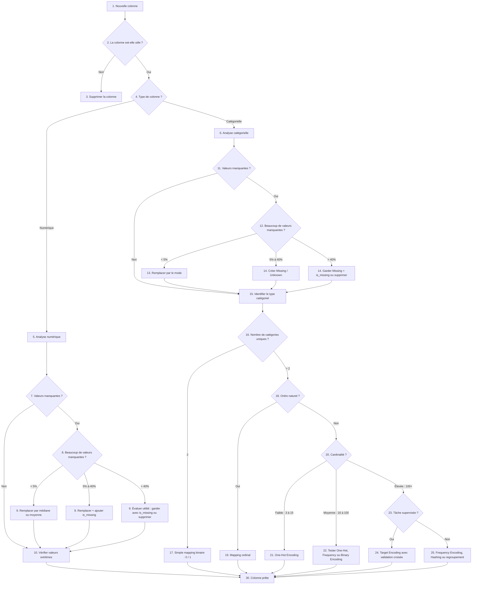

# Cours complet — EDA, variables catégorielles, valeurs manquantes et encodage

## 1. Objectif du cours

L’objectif est de comprendre comment préparer un dataset avant d’entraîner un modèle de Machine Learning.

Ce cours couvre :

1. l’EDA, ou **Exploratory Data Analysis** ;
2. l’identification des variables numériques et catégorielles ;
3. les valeurs manquantes ;
4. les variables binaires, nominales et ordinales ;
5. le simple mapping ;
6. le One-Hot Encoding ;
7. les cas où le One-Hot Encoding devient dangereux ;
8. les variables avec beaucoup de catégories ;
9. le diagramme de décision pour choisir la bonne stratégie ;
10. un exemple complet en Python.

---

## 2. C’est quoi l’EDA ?

L’**EDA** signifie **Exploratory Data Analysis**.

En français, on peut dire :

> Analyse exploratoire des données.

L’EDA est l’étape où l’on explore un dataset pour comprendre ce qu’il contient avant de construire un modèle.

Avant d’utiliser un modèle, il faut répondre à plusieurs questions :

1. Combien de lignes contient le dataset ?
2. Combien de colonnes contient le dataset ?
3. Quelles colonnes sont numériques ?
4. Quelles colonnes sont catégorielles ?
5. Quelles colonnes contiennent des valeurs manquantes ?
6. Quelles colonnes contiennent des valeurs anormales ?
7. Quelle est la variable cible ?
8. Les classes sont-elles équilibrées ?
9. Quelles colonnes doivent être transformées ?
10. Quelles colonnes doivent être supprimées ?

---

## 3. Pourquoi l’EDA est importante ?

Un modèle de Machine Learning ne comprend pas les données comme un humain.

Un humain peut lire :

```text
Pays = Canada
Contrat = Premium
Client actif = Oui
Niveau de risque = élevé
```

Mais un modèle travaille surtout avec des nombres.

Les algorithmes font des calculs mathématiques : distances, multiplications de matrices, gradients, optimisations, probabilités. Ils ne peuvent pas directement calculer avec des mots comme `Canada`, `Premium` ou `élevé`. Les algorithmes de Machine Learning ont besoin de valeurs numériques pour effectuer leurs calculs. 

Donc l’EDA permet de décider comment transformer les colonnes avant l’entraînement.

---

## 4. Exemple de dataset

Imaginons un dataset de clients :

| age | pays    | contrat  | satisfaction | appels_support | churn |
| --: | ------- | -------- | ------------ | -------------: | ----- |
|  25 | Canada  | Basic    | faible       |              5 | Oui   |
|  42 | France  | Premium  | élevée       |              1 | Non   |
|  31 | Canada  | Standard | moyenne      |              2 | Non   |
|  55 | Maroc   | Basic    | faible       |              7 | Oui   |
|  28 | Tunisie | Premium  | élevée       |              0 | Non   |

La cible est :

```text
churn
```

Elle indique si le client a quitté ou non.

Les colonnes explicatives sont :

```text
age
pays
contrat
satisfaction
appels_support
```

---

## 5. Charger les données avec Pandas

```python
import pandas as pd

df = pd.read_csv("clients.csv")
```

---

## 6. Voir les premières lignes

```python
df.head()
```

Cette commande permet de voir rapidement la forme du dataset.

---

## 7. Voir la taille du dataset

```python
df.shape
```

Exemple :

```text
(10000, 6)
```

Cela signifie :

```text
10000 lignes
6 colonnes
```

---

## 8. Voir les noms des colonnes

```python
df.columns
```

Exemple :

```text
Index(['age', 'pays', 'contrat', 'satisfaction', 'appels_support', 'churn'], dtype='object')
```

---

## 9. Voir les types de colonnes

```python
df.info()
```

Exemple :

```text
age                int64
pays               object
contrat            object
satisfaction       object
appels_support     int64
churn              object
```

Ici :

1. `age` est numérique ;
2. `appels_support` est numérique ;
3. `pays` est catégorielle ;
4. `contrat` est catégorielle ;
5. `satisfaction` est catégorielle ;
6. `churn` est la cible catégorielle.

---

## 10. Comprendre les variables numériques

Pour les variables numériques :

```python
df.describe()
```

Exemple :

| colonne        | moyenne | min | max |
| -------------- | ------: | --: | --: |
| age            |      38 |  18 |  80 |
| appels_support |       3 |   0 |  20 |

Cette commande aide à détecter :

1. les valeurs extrêmes ;
2. les moyennes étranges ;
3. les minimums impossibles ;
4. les maximums suspects.

Exemples de valeurs suspectes :

```text
age = 250
age = -4
appels_support = 10000
revenu = -5000
```

---

## 11. Comprendre les variables catégorielles

Une variable catégorielle représente des groupes ou des qualités, pas des quantités. Par exemple : pays, niveau d’éducation, couleur, type de contrat ou groupe sanguin. 

Exemples :

```text
pays = Canada, France, Maroc
contrat = Basic, Standard, Premium
satisfaction = faible, moyenne, élevée
churn = Oui, Non
```

Pour voir les valeurs possibles :

```python
df["contrat"].unique()
```

Pour compter les valeurs :

```python
df["contrat"].value_counts()
```

Exemple :

```text
Basic       4500
Standard    3500
Premium     2000
```

---

# 12. Les trois grands types de variables catégorielles

## 12.1 Variable binaire

Une variable binaire a seulement deux valeurs possibles.

Exemples :

```text
Oui / Non
True / False
Spam / Not Spam
Actif / Inactif
Normal / Abnormal
```

Pour ce type de variable, un simple mapping suffit souvent :

```text
Oui → 1
Non → 0
```

Une variable binaire peut être représentée avec un seul nombre, souvent `0` et `1`. 

---

## 12.2 Variable nominale

Une variable nominale contient des catégories sans ordre naturel.

Exemples :

```text
Canada, France, Maroc
Rouge, Bleu, Vert
Visa, Mastercard, Amex
Montréal, Toronto, Paris
```

Il n’y a pas de hiérarchie logique.

On ne peut pas dire :

```text
Canada < France < Maroc
```

ou :

```text
Rouge < Bleu < Vert
```

Les variables nominales n’ont pas d’ordre naturel. L’encodage ne doit donc pas imposer un faux ordre numérique. 

---

## 12.3 Variable ordinale

Une variable ordinale contient des catégories avec un ordre naturel.

Exemples :

```text
faible < moyen < élevé
débutant < intermédiaire < avancé
insatisfait < neutre < satisfait
XS < S < M < L < XL
```

Ici, l’ordre est important.

Pour ce type de variable, on peut faire un mapping ordinal :

```text
faible → 0
moyen → 1
élevé → 2
```

Les variables ordinales ont un ordre significatif, et l’encodage doit préserver cet ordre. 

---

# 13. Pourquoi ne pas mettre simplement des numéros partout ?

Prenons une variable `couleur`.

```text
Rouge
Bleu
Vert
```

Mauvaise idée :

```text
Rouge → 1
Bleu  → 2
Vert  → 3
```

Le problème est que le modèle peut croire que :

```text
Vert > Bleu > Rouge
```

ou que :

```text
Vert = Rouge + Bleu
```

Ce raisonnement est faux.

La transformation naïve des catégories en nombres peut créer de fausses relations mathématiques, comme un faux ordre ou une fausse distance entre les catégories. 

---

# 14. C’est quoi le simple mapping ?

Le **simple mapping** consiste à remplacer directement une catégorie par un nombre.

Exemple binaire :

```text
Oui → 1
Non → 0
```

Exemple ordinal :

```text
faible → 0
moyen → 1
élevé → 2
```

Le simple mapping est recommandé dans deux cas :

1. variable binaire ;
2. variable ordinale avec un ordre clair.

---

## 15. Simple mapping pour une variable binaire

Exemple :

| churn |
| ----- |
| Oui   |
| Non   |
| Non   |
| Oui   |

Mapping :

```python
df["churn_encoded"] = df["churn"].map({
    "Non": 0,
    "Oui": 1
})
```

Résultat :

| churn | churn_encoded |
| ----- | ------------: |
| Oui   |             1 |
| Non   |             0 |
| Non   |             0 |
| Oui   |             1 |

---

## 16. Simple mapping pour une variable ordinale

Exemple :

| satisfaction |
| ------------ |
| faible       |
| moyenne      |
| élevée       |
| faible       |

Mapping :

```python
satisfaction_mapping = {
    "faible": 0,
    "moyenne": 1,
    "élevée": 2
}

df["satisfaction_encoded"] = df["satisfaction"].map(satisfaction_mapping)
```

Résultat :

| satisfaction | satisfaction_encoded |
| ------------ | -------------------: |
| faible       |                    0 |
| moyenne      |                    1 |
| élevée       |                    2 |
| faible       |                    0 |

Ce mapping est acceptable parce que l’ordre existe réellement.

---

# 17. C’est quoi le One-Hot Encoding ?

Le **One-Hot Encoding** transforme une variable catégorielle en plusieurs colonnes binaires.

Chaque catégorie devient une colonne.

Exemple avec `contrat` :

```text
Basic
Standard
Premium
```

Après One-Hot Encoding :

| contrat  | contrat_Basic | contrat_Standard | contrat_Premium |
| -------- | ------------: | ---------------: | --------------: |
| Basic    |             1 |                0 |               0 |
| Standard |             0 |                1 |               0 |
| Premium  |             0 |                0 |               1 |
| Basic    |             1 |                0 |               0 |

Le One-Hot Encoding crée une colonne binaire pour chaque catégorie : `1` si la ligne appartient à cette catégorie, sinon `0`. 

---

# 18. Quand utiliser le One-Hot Encoding ?

Le One-Hot Encoding est recommandé quand :

1. la variable est catégorielle ;
2. la variable est nominale ;
3. il n’y a pas d’ordre naturel ;
4. le nombre de catégories est raisonnable ;
5. on veut éviter un faux ordre numérique.

Exemples adaptés :

```text
pays
type de contrat
couleur
canal de vente
type de paiement
marque avec peu de valeurs
```

Exemple :

```text
paiement = Carte, PayPal, Virement
```

One-Hot Encoding :

| paiement | paiement_Carte | paiement_PayPal | paiement_Virement |
| -------- | -------------: | --------------: | ----------------: |
| Carte    |              1 |               0 |                 0 |
| PayPal   |              0 |               1 |                 0 |
| Virement |              0 |               0 |                 1 |

---

# 19. One-Hot Encoding avec Pandas

```python
import pandas as pd

df = pd.DataFrame({
    "contrat": ["Basic", "Standard", "Premium", "Basic"],
    "age": [25, 42, 31, 55]
})

df_encoded = pd.get_dummies(df, columns=["contrat"], dtype=int)

print(df_encoded)
```

Résultat :

```text
   age  contrat_Basic  contrat_Premium  contrat_Standard
0   25              1                0                 0
1   42              0                0                 1
2   31              0                1                 0
3   55              1                0                 0
```

---

# 20. One-Hot Encoding avec Scikit-Learn

```python
from sklearn.preprocessing import OneHotEncoder

encoder = OneHotEncoder(sparse_output=False)

encoded = encoder.fit_transform(df[["contrat"]])

print(encoded)
```

Résultat :

```text
[[1. 0. 0.]
 [0. 0. 1.]
 [0. 1. 0.]
 [1. 0. 0.]]
```

---

# 21. Pourquoi utiliser `handle_unknown="ignore"` ?

Un problème fréquent arrive quand une catégorie est présente dans le test, mais pas dans l’entraînement.

Exemple :

Dans les données d’entraînement :

```text
Canada
France
Maroc
```

Dans les données de test :

```text
Tunisie
```

Si le modèle n’a jamais vu `Tunisie`, l’encodeur peut générer une erreur.

Solution :

```python
OneHotEncoder(handle_unknown="ignore")
```

Exemple :

```python
from sklearn.preprocessing import OneHotEncoder

encoder = OneHotEncoder(
    handle_unknown="ignore",
    sparse_output=False
)
```

---

# 22. Quand éviter le One-Hot Encoding ?

Il faut éviter le One-Hot Encoding si une variable contient beaucoup de catégories.

Exemples :

```text
ville
code postal
ID produit
ID client
adresse email
nom d’utilisateur
référence de commande
```

Si une colonne contient 10 000 valeurs différentes, le One-Hot Encoding peut créer 10 000 colonnes.

Cela peut causer :

1. un dataset énorme ;
2. beaucoup de colonnes presque vides ;
3. une consommation mémoire élevée ;
4. un entraînement plus lent ;
5. un risque de surapprentissage ;
6. une mauvaise généralisation.

Les variables à haute cardinalité nécessitent souvent des techniques spéciales, car le One-Hot Encoding peut créer un nombre trop grand de colonnes. 

---

# 23. C’est quoi la cardinalité ?

La **cardinalité** est le nombre de valeurs uniques dans une colonne.

Exemple :

```text
contrat = Basic, Standard, Premium
```

Cardinalité :

```text
3
```

Exemple :

```text
ville = Montréal, Toronto, Paris, Tunis, Casablanca, ...
```

Cardinalité possible :

```text
5000
```

Pour calculer la cardinalité :

```python
df["contrat"].nunique()
```

Pour toutes les colonnes catégorielles :

```python
categorical_cols = df.select_dtypes(include=["object"]).columns

for col in categorical_cols:
    print(col, df[col].nunique())
```

---

# 24. Règle simple pour la cardinalité

| Nombre de catégories | Situation              | Technique possible                                            |
| -------------------: | ---------------------- | ------------------------------------------------------------- |
|                    2 | Binaire                | Mapping 0/1                                                   |
|               3 à 15 | Faible cardinalité     | One-Hot Encoding                                              |
|             16 à 100 | Cardinalité moyenne    | Tester One-Hot, Frequency Encoding ou Binary Encoding         |
|                 100+ | Haute cardinalité      | Éviter One-Hot classique                                      |
|                1000+ | Très haute cardinalité | Hashing, regroupement, embeddings ou suppression selon le cas |

---

# 25. Que faire avec une variable à haute cardinalité ?

## 25.1 Regrouper les catégories rares

Exemple :

```text
Montréal
Toronto
Paris
Lyon
Tunis
Casablanca
...
```

On peut garder les catégories fréquentes et regrouper les autres dans `Other`.

```python
top_categories = df["ville"].value_counts().nlargest(10).index

df["ville_grouped"] = df["ville"].where(
    df["ville"].isin(top_categories),
    "Other"
)
```

---

## 25.2 Frequency Encoding

Le **Frequency Encoding** remplace chaque catégorie par sa fréquence.

Exemple :

| pays   | fréquence |
| ------ | --------: |
| France |       450 |
| USA    |       300 |
| Canada |       150 |

Code :

```python
freq_map = df["pays"].value_counts()

df["pays_freq"] = df["pays"].map(freq_map)
```

Avantage :

```text
Une seule colonne au lieu de plusieurs centaines.
```

Limite :

```text
Deux catégories avec la même fréquence obtiennent la même valeur.
```

---

## 25.3 Target Encoding

Le **Target Encoding** remplace une catégorie par la moyenne de la cible pour cette catégorie.

Exemple pour prédire `churn` :

| ville    | taux moyen de churn |
| -------- | ------------------: |
| Montréal |                0.12 |
| Paris    |                0.20 |
| Tunis    |                0.08 |

Attention : le Target Encoding peut créer du **data leakage** s’il est mal utilisé. Il faut l’utiliser avec validation croisée ou dans un pipeline propre. Le Target Encoding direct peut provoquer une fuite de données parce que la transformation utilise la cible elle-même. 

---

## 25.4 Hashing Encoding

Le **Hashing Encoding** transforme les catégories vers un nombre fixe de colonnes.

Avantage :

```text
Le nombre de colonnes reste fixe, même avec beaucoup de catégories.
```

Inconvénient :

```text
Deux catégories différentes peuvent tomber dans la même colonne.
```

C’est ce qu’on appelle une collision.

---

# 26. Les valeurs manquantes

## 26.1 Détecter les valeurs manquantes

```python
df.isnull().sum()
```

Exemple :

```text
age                  0
pays                12
contrat              0
satisfaction       250
appels_support       4
churn                0
```

---

## 26.2 Calculer le pourcentage de valeurs manquantes

```python
missing_percent = df.isnull().mean() * 100

print(missing_percent)
```

Exemple :

```text
age                 0.0
pays                1.2
contrat             0.0
satisfaction       25.0
appels_support      0.4
churn               0.0
```

---

# 27. Que faire avec les valeurs manquantes numériques ?

## 27.1 Peu de valeurs manquantes

Si une variable numérique a peu de valeurs manquantes, on peut remplacer par :

1. la moyenne ;
2. la médiane ;
3. une valeur fixe ;
4. une stratégie métier.

Exemple avec la médiane :

```python
df["age"] = df["age"].fillna(df["age"].median())
```

La médiane est souvent préférable si la colonne contient des valeurs extrêmes.

---

## 27.2 Beaucoup de valeurs manquantes numériques

Si une colonne numérique a beaucoup de valeurs manquantes, on peut ajouter une colonne indicatrice.

```python
df["age_is_missing"] = df["age"].isnull().astype(int)
df["age"] = df["age"].fillna(df["age"].median())
```

Cela permet de conserver l’information :

```text
Cette valeur était absente.
```

---

# 28. Que faire avec les valeurs manquantes catégorielles ?

Pour une variable catégorielle, il y a plusieurs stratégies.

## 28.1 Remplacer par la valeur la plus fréquente

Exemple :

```python
df["contrat"] = df["contrat"].fillna(df["contrat"].mode()[0])
```

À utiliser si :

1. il y a peu de valeurs manquantes ;
2. la catégorie dominante est logique ;
3. l’absence d’information ne semble pas importante.

---

## 28.2 Créer une catégorie `Unknown` ou `Missing`

Exemple :

```python
df["contrat"] = df["contrat"].fillna("Unknown")
```

C’est souvent une très bonne stratégie, car l’absence d’information peut être utile.

Exemple :

```text
contrat = Missing
```

peut signifier :

```text
information non fournie
client incomplet
problème de collecte
cas particulier
```

Pour les colonnes catégorielles, une bonne pratique consiste souvent à créer une catégorie séparée `Unknown` ou `Missing`, surtout si la valeur manquante peut porter une information. 

---

## 28.3 Ajouter une colonne indicatrice

Exemple :

```python
df["contrat_is_missing"] = df["contrat"].isnull().astype(int)
df["contrat"] = df["contrat"].fillna("Missing")
```

Résultat :

| contrat | contrat_is_missing |
| ------- | -----------------: |
| Basic   |                  0 |
| Missing |                  1 |
| Premium |                  0 |

Cette stratégie est utile quand beaucoup de valeurs sont manquantes.

---

## 28.4 Supprimer la colonne

À considérer si :

1. la colonne contient trop de valeurs manquantes ;
2. la colonne n’a pas de valeur métier ;
3. la colonne n’améliore pas le modèle ;
4. la colonne est trop bruitée ;
5. la colonne est difficile à expliquer.

Exemple :

```python
df = df.drop(columns=["ancienne_colonne"])
```

---

# 29. Règle pratique pour les valeurs manquantes

| Pourcentage manquant | Stratégie possible                           |
| -------------------: | -------------------------------------------- |
|                  0 % | Rien à faire                                 |
|                < 5 % | Mode pour catégoriel, médiane pour numérique |
|           5 % à 40 % | Imputation + indicateur `is_missing`         |
|               > 40 % | Évaluer l’utilité de la colonne              |
|               > 70 % | Souvent supprimer, sauf forte valeur métier  |

---

# 30. Diagramme de décision complet



---

# 31. Tableau de décision pour l’encodage

| Situation                                     | Exemple                     | Technique recommandée                   |
| --------------------------------------------- | --------------------------- | --------------------------------------- |
| Variable binaire                              | Oui / Non                   | Mapping 0/1                             |
| Variable ordinale                             | faible / moyen / élevé      | Mapping ordinal                         |
| Variable nominale avec peu de catégories      | pays, contrat, couleur      | One-Hot Encoding                        |
| Variable nominale avec beaucoup de catégories | ville, produit, code postal | Frequency, Target, Binary ou Hashing    |
| Catégorie manquante peu fréquente             | 1 % manquant                | Mode                                    |
| Catégorie manquante informative               | valeur absente importante   | Missing / Unknown                       |
| Beaucoup de valeurs manquantes                | 50 % ou plus                | Missing + is_missing ou suppression     |
| Tâche supervisée avec haute cardinalité       | ville → churn               | Target Encoding avec validation croisée |
| Tâche non supervisée avec haute cardinalité   | produit, ID, ville          | Frequency ou Hashing                    |

---

# 32. Exemple complet en Python

## 32.1 Dataset exemple

```python
import pandas as pd
import numpy as np

df = pd.DataFrame({
    "age": [25, 42, 31, np.nan, 55, 28],
    "pays": ["Canada", "France", "Canada", "Maroc", np.nan, "Tunisie"],
    "contrat": ["Basic", "Premium", "Standard", "Basic", "Premium", np.nan],
    "satisfaction": ["faible", "élevée", "moyenne", np.nan, "faible", "élevée"],
    "appels_support": [5, 1, 2, 7, np.nan, 0],
    "churn": ["Oui", "Non", "Non", "Oui", "Oui", "Non"]
})
```

---

## 32.2 EDA rapide

```python
print(df.head())
print(df.shape)
print(df.info())
print(df.isnull().sum())
```

---

## 32.3 Séparer X et y

```python
X = df.drop("churn", axis=1)
y = df["churn"]
```

---

## 32.4 Encoder la cible

```python
y = y.map({
    "Non": 0,
    "Oui": 1
})
```

---

## 32.5 Identifier les colonnes

```python
numeric_features = ["age", "appels_support"]

binary_features = []

ordinal_features = ["satisfaction"]

nominal_features = ["pays", "contrat"]
```

---

## 32.6 Définir l’ordre ordinal

```python
satisfaction_order = ["faible", "moyenne", "élevée"]
```

---

## 32.7 Construire un pipeline propre

```python
from sklearn.model_selection import train_test_split
from sklearn.preprocessing import OneHotEncoder, OrdinalEncoder, StandardScaler
from sklearn.impute import SimpleImputer
from sklearn.compose import ColumnTransformer
from sklearn.pipeline import Pipeline
from sklearn.linear_model import LogisticRegression

X_train, X_test, y_train, y_test = train_test_split(
    X,
    y,
    test_size=0.2,
    random_state=42
)

numeric_pipeline = Pipeline(steps=[
    ("imputer", SimpleImputer(strategy="median")),
    ("scaler", StandardScaler())
])

ordinal_pipeline = Pipeline(steps=[
    ("imputer", SimpleImputer(strategy="constant", fill_value="Missing")),
    ("encoder", OrdinalEncoder(
        categories=[["faible", "moyenne", "élevée", "Missing"]],
        handle_unknown="use_encoded_value",
        unknown_value=-1
    ))
])

nominal_pipeline = Pipeline(steps=[
    ("imputer", SimpleImputer(strategy="constant", fill_value="Missing")),
    ("encoder", OneHotEncoder(
        handle_unknown="ignore",
        sparse_output=False
    ))
])

preprocessor = ColumnTransformer(transformers=[
    ("num", numeric_pipeline, numeric_features),
    ("ord", ordinal_pipeline, ordinal_features),
    ("nom", nominal_pipeline, nominal_features)
])

model = Pipeline(steps=[
    ("preprocessor", preprocessor),
    ("classifier", LogisticRegression())
])

model.fit(X_train, y_train)

score = model.score(X_test, y_test)

print("Score :", score)
```

---

# 33. Erreurs fréquentes à éviter

## 33.1 Faire un mapping numérique sur une variable nominale

Mauvais exemple :

```python
df["pays_encoded"] = df["pays"].map({
    "Canada": 1,
    "France": 2,
    "Maroc": 3
})
```

Problème :

```text
Le modèle peut croire que Maroc > France > Canada.
```

---

## 33.2 Faire du One-Hot Encoding sur une colonne avec trop de catégories

Mauvais cas :

```text
ID client avec 500 000 valeurs différentes
```

Problème :

```text
500 000 nouvelles colonnes possibles.
```

---

## 33.3 Remplacer toutes les valeurs manquantes par le mode

Mauvais réflexe :

```python
df["contrat"] = df["contrat"].fillna(df["contrat"].mode()[0])
```

Ce n’est pas toujours mauvais, mais ce n’est pas toujours intelligent.

Si l’absence de valeur est informative, il vaut mieux créer :

```text
Missing
```

ou :

```text
Unknown
```

---

## 33.4 Encoder avant le train/test split

Mauvaise logique :

```python
df_encoded = pd.get_dummies(df)
X_train, X_test, y_train, y_test = train_test_split(df_encoded, y)
```

Meilleure logique :

```text
1. séparer X et y ;
2. faire le train/test split ;
3. apprendre les transformations sur le train ;
4. appliquer les transformations au test.
```

---

# 34. Résumé général

## 34.1 EDA

L’EDA sert à comprendre les données avant le modèle.

On vérifie :

1. la taille du dataset ;
2. les types de colonnes ;
3. les valeurs manquantes ;
4. les valeurs extrêmes ;
5. les variables catégorielles ;
6. la cardinalité ;
7. la cible ;
8. les transformations nécessaires.

---

## 34.2 Simple mapping

À utiliser pour :

1. variable binaire ;
2. variable ordinale.

Exemples :

```text
Oui → 1
Non → 0
```

```text
faible → 0
moyen → 1
élevé → 2
```

---

## 34.3 One-Hot Encoding

À utiliser pour :

1. variable nominale ;
2. pas d’ordre naturel ;
3. peu ou moyennement de catégories.

Exemple :

```text
contrat = Basic, Standard, Premium
```

devient :

```text
contrat_Basic
contrat_Standard
contrat_Premium
```

---

## 34.4 Haute cardinalité

À surveiller quand une colonne contient beaucoup de valeurs uniques.

Exemples :

```text
ville
code postal
ID produit
ID client
```

Solutions possibles :

1. regrouper les catégories rares ;
2. Frequency Encoding ;
3. Target Encoding ;
4. Binary Encoding ;
5. Hashing Encoding ;
6. suppression si la colonne n’est pas utile.

---

## 34.5 Valeurs manquantes

Pour les valeurs manquantes :

1. peu de valeurs manquantes : imputation simple ;
2. valeurs manquantes moyennes : imputation + indicateur ;
3. beaucoup de valeurs manquantes : évaluer l’utilité de la colonne ;
4. valeurs manquantes catégorielles : souvent `Missing` ou `Unknown`.

---

# 35. Phrase finale à retenir

L’EDA permet de comprendre les données.
Le simple mapping sert aux variables binaires ou ordinales.
Le One-Hot Encoding sert aux variables nominales avec peu de catégories.
Les valeurs manquantes doivent être traitées avant l’encodage.
Une variable avec trop de catégories ne doit pas être encodée naïvement avec One-Hot Encoding.
